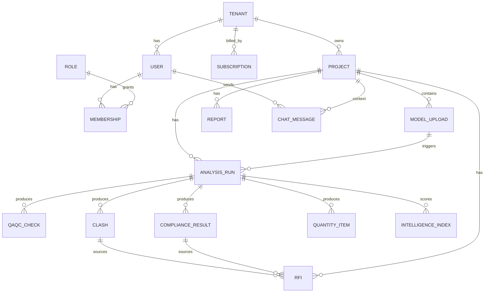
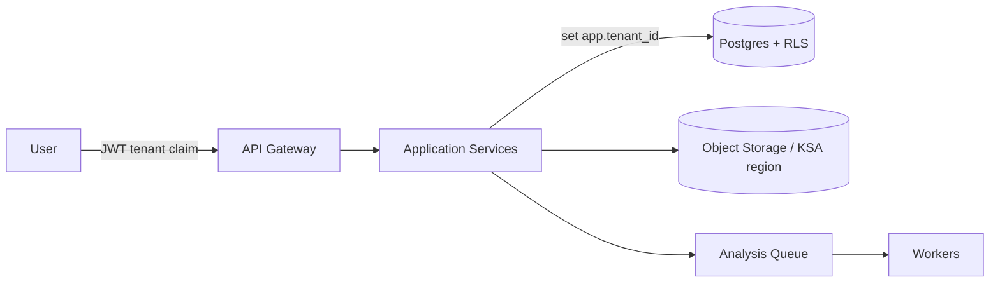
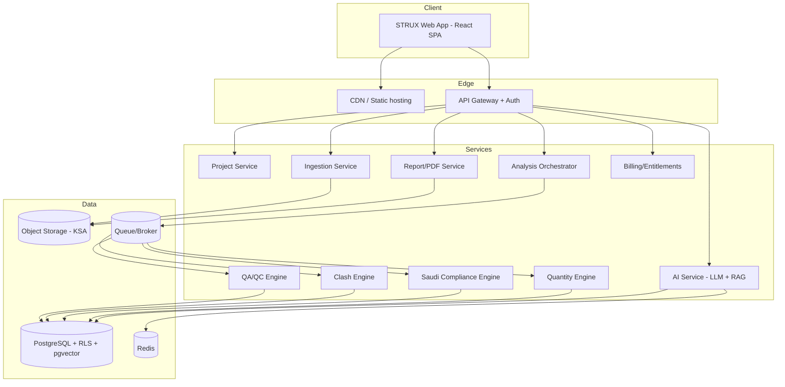
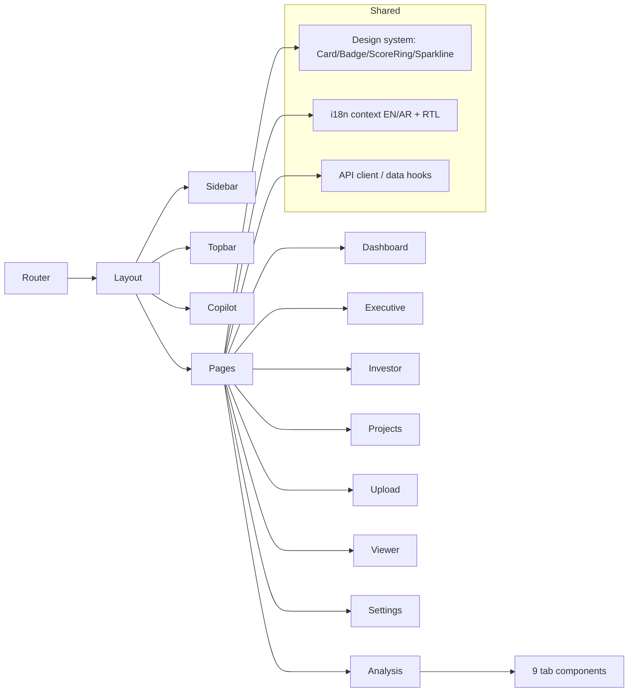
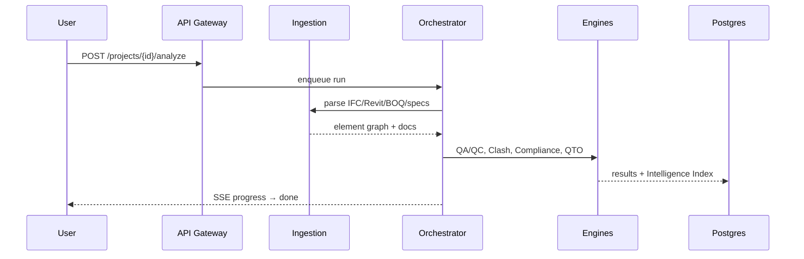
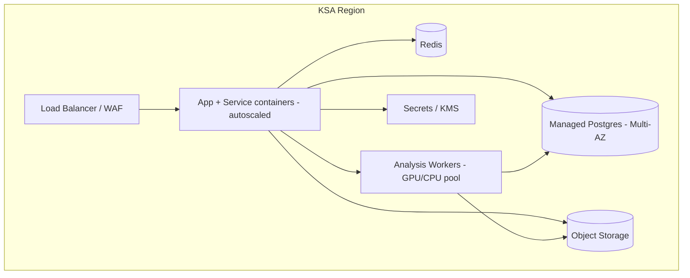

# STRUX — Master Handover Package (Combined)

> Single-file export of `docs/handover/`. Generated 2026-06-02.

---

# STRUX — Master Handover Package

> **The Intelligence Layer Above BIM** — an AI-powered BIM & Construction Intelligence SaaS for the Saudi & GCC market.

This package is a complete, self-contained handover. A new team (or AI environment such as **Lovable**) can rebuild STRUX end-to-end from these documents without access to the original codebase.

## Reading order

| # | Document | Contents |
|---|----------|----------|
| 01 | [Executive Product Overview](./01-product-overview.md) | Vision, mission, problem, market, personas, advantage |
| 02 | [Product Requirements (PRD)](./02-prd.md) | Every module & feature: purpose, value, flow, acceptance, deps |
| 03 | [User Stories](./03-user-stories.md) | All roles, full backlog of stories |
| 04 | [Information Architecture](./04-information-architecture.md) | Pages, navigation, menus, dashboard layouts |
| 05 | [Database Design](./05-database-design.md) | ERD, tables, fields, relationships, indexes (SQL) |
| 06 | [API Documentation](./06-api-documentation.md) | Endpoints, request/response, auth |
| 07 | [UI/UX Specification](./07-uiux-spec.md) | Per-page layout, components, permissions |
| 08 | [Design System](./08-design-system.md) | Colors, type, spacing, grid, icons, components |
| 09 | [Authentication & Roles](./09-auth-roles.md) | RBAC matrix, permissions, approval workflows |
| 10 | [AI Module](./10-ai-module.md) | Assistant, RFI, submittals, drawings, cost, schedule + prompts |
| 11 | [SaaS Architecture](./11-saas-architecture.md) | Multi-tenant, plans, billing, isolation |
| 12 | [Investor Portal](./12-investor-portal.md) | KPI structure, financial & health metrics, layout |
| 13 | [Technical Architecture](./13-technical-architecture.md) | FE/BE/DB/Cloud + Mermaid diagrams |
| 14 | [Development Roadmap](./14-roadmap.md) | MVP → V1 → V2 → V3, prioritized backlog |
| 15 | [Lovable Migration Prompt](./15-lovable-migration-prompt.md) | Single paste-ready prompt to recreate STRUX |

## Current implementation snapshot (prototype)

- **Stack:** React 18 + TypeScript + Vite + Tailwind CSS + React Router + Recharts + Three.js (`@react-three/fiber`/`drei`). Mock data only; no backend yet.
- **Bilingual:** English ⇄ Arabic with full RTL (Tajawal typeface), persisted language.
- **Implemented surfaces:** Landing, Login, Command Dashboard, Executive Dashboard, Investor Dashboard, Project Workspace, BIM Upload (AI pipeline), AI Analysis (9 tabs incl. 3D viewer), Admin & Settings, floating STRUX Copilot, STRUX Intelligence Index™.

## Positioning (must be preserved)

STRUX is **NOT** a BIM viewer and does **not** replace Autodesk/Revit/Navisworks. It is an **intelligence layer above** the BIM stack (Revit, Navisworks, IFC, BOQ, specs) that turns engineering data into executive decisions.

## Brand essentials

- **Name/wordmark:** STRUX (letter-spaced) + small gradient "AI" badge.
- **Mark:** hexagonal cube with a negative-space "S", blue (top-left) / charcoal (bottom-right) split, silver accent triangles.
- **Palette:** dark navy (`#070b18`–`#16224d`), electric blue (`#2f6bff`), cyan accent (`#22d3ee`), silver text (`#e3e8f2`).
- **Signature metric:** STRUX Intelligence Index™ (0–100; composite of compliance, quality, risk, cost, schedule).

> All figures across the product are **illustrative prototype / projection data**. The company is **Pre-Seed**, raising **SAR 6–7M**.


---

# 01 · Executive Product Overview

## Vision
To become the **operating system for construction intelligence** in Saudi Arabia and the GCC — the layer where every engineering decision is informed by AI analysis of the project's models, documents and regulations.

## Mission
Turn BIM models, IFC/Revit files, BOQs, specifications and Saudi regulatory requirements into **clear, prioritized, financially-quantified decisions** for the people who deliver construction — without replacing the tools they already use.

## Problem Statement
Saudi construction runs on Revit, Navisworks and IFC models that **no executive can read at scale**. The result:
- **Rework** consumes **5–15%** of total construction cost.
- Coordination failures, BIM governance gaps and compliance exposure stay invisible until they become **change orders and delays**.
- Every model, BOQ and specification hides risk that is only discovered manually, late, and inconsistently.
- Saudi-specific compliance (SBC, Civil Defense, Accessibility, Energy, Municipality) is enforced manually with deep local expertise that doesn't scale.

**The data exists. The intelligence layer does not.**

## Solution (one line)
STRUX ingests the existing BIM stack and adds an **AI intelligence layer** that runs automated QA/QC, clash intelligence, Saudi compliance validation, quantity reconciliation, RFI generation and executive reporting — surfaced as the **STRUX Intelligence Index™**.

## Target Market
- **Geography:** KSA first, then GCC (UAE, Qatar).
- **Segments:** main contractors, engineering consultancies, BIM/VDC departments, project owners & developers (incl. Vision 2030 giga-projects), government & mega-projects.
- **Sizing (bottom-up, conservative estimates):**
  - **TAM** — GCC construction technology: **~$2.4B**
  - **SAM** — KSA BIM & compliance software: **~$0.38B**
  - **SOM** — serviceable in 3 years: **~$45M**

## Customer Personas
| Persona | Goals | Pain today | STRUX value |
|---|---|---|---|
| **Project Owner / Developer** | Protect budget & schedule; de-risk delivery | No portfolio-level visibility into engineering risk | Executive dashboard, financial exposure, Intelligence Index |
| **Engineering Consultant** | Defensible quality & compliance | Manual checks, inconsistent reviews | Automated QA/QC + Saudi compliance evidence |
| **Main Contractor** | Avoid rework & claims | Clashes found on site, not in model | Clash intelligence with cost/delay scoring |
| **Project Manager** | Hit milestones | Reactive issue management | Prioritized decisions, RFI automation |
| **BIM / VDC Manager** | Model governance | Hygiene & coordination at scale | QA/QC engine, federated model health |
| **Site Engineer** | Build right first time | Drawings vs reality gaps | RFIs, clash markups, quantity checks |
| **Admin** | Control access & billing | Tool sprawl | Roles, permissions, KSA-hosted SaaS |
| **Investor** | Diligence & traction | No structured view | Investor dashboard, KPIs, projections |

## Competitive Advantage
1. **Intelligence layer, not a viewer** — augments Autodesk/Navisworks, never competes with authoring.
2. **Saudi Compliance Engine** — SBC, Civil Defense, Balady, Energy encoded as a living knowledge base.
3. **Arabic-native + full RTL** executive experience.
4. **KSA data residency** (PDPL/SDAIA aligned) — unlocks government & giga-projects.
5. **Vendor-neutral** — works across Revit, IFC and Navisworks.
6. **Compounding data moat** — a Saudi-specific portfolio learning network that improves with every project.

## Why Now
Vision 2030 construction boom · accelerating BIM adoption · Saudi Building Code enforcement · digital-transformation mandates · rising rework costs · engineering talent shortages. *The market is ready now in a way it was not five years ago.*

## North-star metric
**STRUX Intelligence Index™** adoption — number of projects whose decisions are governed by the Index, and the Index improvement (Δ) per project over time.


---

# 02 · Product Requirements Document (PRD)

Each feature lists **Purpose · Business Value · User Flow · Acceptance Criteria · Dependencies**. Status reflects the current prototype (UI implemented with mock data unless noted).

---

## M0 · Marketing Landing (`/`)
- **Purpose:** Convert visitors; communicate positioning ("Intelligence Layer Above BIM").
- **Business Value:** Top-of-funnel; investor & customer credibility.
- **User Flow:** Visit `/` → read hero/positioning/modules/Vision 2030/investor teaser → CTA "Launch Demo" → `/app/dashboard` or "Sign in" → `/login`.
- **Acceptance:** Bilingual EN/AR + RTL; animated but respects `prefers-reduced-motion`; all CTAs route correctly; no fabricated traction metrics (capability metrics only).
- **Dependencies:** i18n, design system, router.

## M1 · Authentication (`/login`)
- **Purpose:** Role-based entry to the workspace.
- **Business Value:** Security, personalization, multi-tenant gate.
- **User Flow:** Choose role (Contractor/Consultant/BIM Manager/Owner) → email + password → enter platform.
- **Acceptance:** Role selectable; form validates; (prototype: any credentials proceed); language toggle present.
- **Dependencies:** Auth service (future), RBAC, i18n.

## M2 · Command Dashboard (`/app/dashboard`)
- **Purpose:** Portfolio-wide operational view.
- **Business Value:** Single pane of glass; daily driver.
- **User Flow:** Land → see hero (BIM health, compliance rings) → KPI cards (with sparklines & deltas) → **Intelligence Index™** → trend/discipline/severity charts → project status list → drill into a project.
- **Acceptance:** 8 KPIs (total issues, high-risk, open RFIs, projects, reports, BIM score, compliance, high-risk clashes); charts render; Index visible; clicking a project opens analysis.
- **Dependencies:** Analytics aggregation API, projects API.

## M3 · Executive Dashboard (`/app/executive`)
- **Purpose:** Board/C-suite view of risk & money.
- **Business Value:** Decision support for owners/directors.
- **User Flow:** View AI Executive Summary card → KPI row (portfolio health, financial exposure, rework avoided, schedule at risk) → project risk heatmap → exposure-by-project chart → top risks → decisions required.
- **Acceptance:** AI summary shows status + recommendation; heatmap colors by score band; Index badge present; figures labeled illustrative.
- **Dependencies:** Risk engine, financial model, Intelligence Index.

## M4 · Investor Dashboard (`/app/investor`)
- **Purpose:** Pre-Seed fundraising narrative.
- **Business Value:** Investor diligence.
- **User Flow:** 16 sections (Problem → … → Funding Roadmap → Vision 2030). See [12-investor-portal](./12-investor-portal.md).
- **Acceptance:** Pre-Seed (SAR 7M, not Series A); projections clearly marked; competitive table; "Why Autodesk can't replicate"; Intelligence Index.
- **Dependencies:** Design system, Index, Vision 2030 component.

## M5 · Project Workspace (`/app/projects`)
- **Purpose:** Manage the portfolio of projects.
- **Business Value:** Organize work; entry to analysis.
- **User Flow:** Grid of project cards (thumbnail, BIM score, issues, high-risk, compliance, risk level, last upload, progress) → "Open Project" → analysis.
- **Acceptance:** Cards show all metrics; risk badge; compliance status; "Upload New Model" CTA.
- **Dependencies:** Projects API, thumbnails.

## M6 · BIM Upload & AI Pipeline (`/app/upload`)
- **Purpose:** Ingest IFC/Revit/BOQ/Specs and run analysis.
- **Business Value:** The activation moment.
- **User Flow:** Select/drag files (IFC, RVT, XLSX, PDF) → "Run STRUX AI Analysis" → 6-stage animated pipeline (Read → Extract → QA/QC → Clash → Compliance → Report) → "View Results".
- **Acceptance:** File types validated; pipeline stages animate to completion; success summary; routes to analysis.
- **Dependencies:** Ingestion service (web-ifc / Autodesk APS), job queue, storage.

## M7 · AI Analysis (`/app/analysis`) — 9 tabs
Tabbed workspace over a federated model.

### M7.1 Overview
- **Purpose:** At-a-glance model intelligence. **Value:** fast triage. **Flow:** scorecards + radar profile + clash funnel + compliance snapshot + AI summary. **Acceptance:** radar 6 axes; AI summary highlights top criticals. **Deps:** all engines.

### M7.2 3D BIM Viewer
- **Purpose:** Spatial context with clash overlays. **Value:** trust & explainability. **Flow:** orbit/zoom; toggle layers (Structure/MEP/Architecture/Clashes); click clash marker → inspector (cost/delay/recommendation). **Acceptance:** layers toggle; markers selectable; reset view; lazy-loaded. **Deps:** Three.js/R3F; (future) real IFC geometry via web-ifc/APS viewer.

### M7.3 QA/QC Checks
- **Purpose:** Model hygiene vs BIM Execution Plan. **Value:** governance. **Flow:** checklist (naming, LOD, coordinates, classification, metadata, duplication, sheet consistency) with status/severity/description/recommendation/discipline. **Acceptance:** each check shows status (Passed/Warning/Failed) + assigned discipline. **Deps:** rule engine.

### M7.4 Clash Intelligence
- **Purpose:** Prioritize clashes by impact, not count. **Value:** avoid rework. **Flow:** register table (ID, conflict, disciplines, severity, **cost impact SAR**, **delay days**, priority, recommendation). **Acceptance:** sortable; cost/delay shown; AI prioritization. **Deps:** clash detection (APS/Navisworks), cost/delay ML scoring.

### M7.5 Saudi Compliance
- **Purpose:** Validate against KSA codes. **Value:** authority approval. **Flow:** area scores (SBC, Civil Defense, Accessibility, Municipality, Energy, Government) + violations (severity, clause, finding, recommendation). **Acceptance:** per-area %, status, violations list. **Deps:** Saudi Compliance Engine knowledge base.

### M7.6 Quantity Extraction
- **Purpose:** Reconcile model take-off vs BOQ. **Value:** procurement accuracy. **Flow:** comparison chart + table (item, unit, model qty, BOQ qty, variance %, risk). **Acceptance:** variance flags >5%/>10%. **Deps:** QTO engine, BOQ parser, fuzzy matching.

### M7.7 RFI Generator
- **Purpose:** Auto-draft RFIs from issues. **Value:** save engineer time. **Flow:** list + detail (subject, question, discipline, priority, attachment, source) → generate from issues → issue/edit/export. **Acceptance:** generated RFI references source clash/violation/quantity. **Deps:** LLM, issue graph, doc-control integration.

### M7.8 AI Chat
- **Purpose:** Conversational analysis Q&A. **Value:** instant answers. **Flow:** suggested prompts + free text → grounded answers. **Acceptance:** answers cite specific clashes/compliance/quantities; bilingual. **Deps:** LLM + RAG over analysis results.

### M7.9 Executive Smart Report
- **Purpose:** Board-ready, exportable report. **Value:** communication. **Flow:** letterhead → scorecards → summary → top 10 issues → recommendations → decision → print/PDF. **Acceptance:** printable; reflects current analysis. **Deps:** report renderer, PDF service.

## M8 · STRUX Copilot (global, floating)
- **Purpose:** Always-available AI analyst across the app.
- **Business Value:** Stickiness; differentiator.
- **User Flow:** Click FAB → chat panel → ask about projects/risks/compliance/exposure/reports.
- **Acceptance:** Available on all `/app/*` pages; bilingual; suggested prompts; keyword-grounded answers.
- **Dependencies:** LLM, portfolio context API.

## M9 · STRUX Intelligence Index™ (cross-cutting)
- **Purpose:** Signature composite metric (0–100).
- **Business Value:** Category-defining KPI; benchmark.
- **Formula (illustrative weights):** `Index = 0.25·Compliance + 0.25·Quality + 0.20·Risk + 0.15·Cost + 0.15·Schedule`.
- **Acceptance:** Shown on Portfolio, Executive, Investor dashboards; sub-scores visible; "Powered by STRUX Intelligence Index™".
- **Dependencies:** all engines feed sub-scores.

## M10 · Admin & Settings (`/app/settings`)
- **Purpose:** Company, users, permissions, integrations, security, subscription.
- **Business Value:** Enterprise readiness & monetization.
- **User Flow:** Tabs: Company profile · Users & Roles · Permissions matrix · Integrations (ACC, Revit, Navisworks, Procore, Aconex, API) · Security (KSA residency) · Subscription (Team/Enterprise/Government).
- **Acceptance:** invite users; RBAC matrix; API key; plan display.
- **Dependencies:** Auth, billing, tenant service.


---

# 03 · User Stories

Format: **As a [User] I want [Feature] So that [Outcome]**. Grouped by role; each maps to PRD modules.

## Owner / Developer
- As an **Owner** I want a portfolio dashboard with a single health index so that I can judge delivery risk across all projects at a glance. *(M2, M9)*
- As an **Owner** I want financial exposure quantified in SAR so that I can prioritize where money is at risk. *(M3)*
- As an **Owner** I want an executive smart report I can export so that I can brief the board. *(M7.9)*
- As an **Owner** I want a project risk heatmap so that I can compare projects on one screen. *(M3)*
- As an **Owner** I want KSA-hosted data so that I meet sovereignty and PDPL requirements. *(M10)*

## Consultant
- As a **Consultant** I want automated QA/QC against the BEP so that my model reviews are consistent and defensible. *(M7.3)*
- As a **Consultant** I want Saudi compliance validation with clause references so that I can evidence authority readiness. *(M7.5)*
- As a **Consultant** I want auto-generated RFIs so that I reduce manual coordination admin. *(M7.7)*
- As a **Consultant** I want bilingual reports so that I can serve Arabic and English stakeholders. *(M0, M7.9)*

## Contractor
- As a **Contractor** I want clashes ranked by cost and delay so that I fix what matters before site. *(M7.4)*
- As a **Contractor** I want quantity reconciliation vs BOQ so that I avoid procurement gaps and claims. *(M7.6)*
- As a **Contractor** I want a 3D view of each clash so that my team understands the fix in context. *(M7.2)*
- As a **Contractor** I want to upload models without plugins so that adoption is frictionless. *(M6)*

## Project Manager
- As a **PM** I want a "decisions required" list so that I can act on the highest-impact items first. *(M3)*
- As a **PM** I want the Intelligence Index trend so that I can show improvement to the client. *(M2, M9)*
- As a **PM** I want RFI status tracking so that I can manage response SLAs. *(M7.7)*
- As a **PM** I want to ask Copilot "show projects with highest risk exposure" so that I prepare for meetings fast. *(M8)*

## Site Engineer
- As a **Site Engineer** I want clash markups and recommended actions so that I build right first time. *(M7.2, M7.4)*
- As a **Site Engineer** I want RFIs with attachments so that I can resolve field conflicts quickly. *(M7.7)*
- As a **Site Engineer** I want quantity checks so that I can validate material orders. *(M7.6)*

## BIM Engineer
- As a **BIM Engineer** I want naming/LOD/coordinate/classification checks so that I enforce model standards. *(M7.3)*
- As a **BIM Engineer** I want a federated model health score so that I can report status to the BIM manager. *(M7.1)*
- As a **BIM Engineer** I want a pipeline that processes IFC/Revit so that I can analyze federated models. *(M6)*
- As a **BIM Engineer** I want duplicate/metadata detection so that take-off and compliance are reliable. *(M7.3)*

## Admin
- As an **Admin** I want a role-based permissions matrix so that I control who can upload, analyze, raise RFIs and view reports. *(M10, RBAC)*
- As an **Admin** I want to invite users and manage the company profile so that onboarding is simple. *(M10)*
- As an **Admin** I want API keys and integrations so that STRUX fits our stack. *(M10)*
- As an **Admin** I want subscription/billing management so that I control spend. *(M11)*

## Investor
- As an **Investor** I want the problem/solution/market in one place so that I can assess the opportunity. *(M4)*
- As an **Investor** I want clearly-marked projections (not actuals) so that diligence is credible. *(M4)*
- As an **Investor** I want the competitive moat and "why incumbents can't replicate" so that I understand defensibility. *(M4)*
- As an **Investor** I want the round terms (Pre-Seed, SAR 7M, use of funds, runway) so that I can evaluate the ask. *(M4)*

## Cross-cutting
- As **any user** I want to toggle Arabic/English with full RTL so that I work in my language. *(i18n)*
- As **any user** I want a premium, fast, responsive UI so that the product feels enterprise-grade. *(Design system)*
- As **any user** I want STRUX Copilot everywhere so that I get answers without leaving my task. *(M8)*


---

# 04 · Information Architecture

## Route map
```
/                       Landing (public)
/login                  Login (public)
/app                    Authenticated shell (sidebar + topbar)
  /app/dashboard        Command Dashboard (default)
  /app/executive        Executive Dashboard
  /app/investor         Investor Dashboard
  /app/projects         Project Workspace
  /app/upload           BIM Upload + AI pipeline
  /app/analysis         AI Analysis (tabbed)
  /app/viewer           3D BIM Viewer (standalone)
  /app/settings         Admin & Settings (tabbed)
*                       Redirect → /
```

## Primary navigation (sidebar)
1. Dashboard
2. Executive
3. Projects
4. Upload BIM
5. AI Analysis
6. 3D Viewer
7. Investor
8. Admin & Settings

Footer of sidebar: user card (name, role, sign-out).

## Topbar
- Page title + tagline ("The Intelligence Layer Above BIM")
- Global search (projects, clashes, RFIs)
- **Investor Demo** toggle (banner + deep-link)
- Language toggle (EN/AR)
- Notifications
- AI Engine status pill
- (Global) floating **STRUX Copilot** launcher (bottom corner)

## Submenus (tabs)

### AI Analysis tabs
`Overview · 3D Model · QA/QC Checks · Clash Intelligence · Saudi Compliance · Quantity Extraction · RFI Generator · AI Chat · Executive Report`

### Settings tabs
`Company · Users & Roles · Permissions · Integrations · Security · Subscription`

### Investor sections (single scroll page)
`Header · 01 Problem · 02 Solution · 03 Why Now · 04 Market · 05 Customer Journey · 06 Technology Architecture · 07 Business Model · 08 Financial Projections · 09 Competitive Advantage · 10 Moat · 11 Why Autodesk Can't Replicate · 12 Intelligence Index · 13 Why STRUX Wins · 14 Product Roadmap · 15 The Round · 16 Funding Roadmap · Vision 2030`

## Dashboard layouts

### Command Dashboard
```
[ Hero strip: greeting + BIM Health ring + Compliance ring ]
[ KPI grid · 8 cards (icon, value, delta, sparkline) ]
[ STRUX Intelligence Index™ (ring + sub-score bars) ]
[ Trend area chart (2/3) | Issues-by-discipline donut (1/3) ]
[ Severity bar chart (1/3) | Project status list (2/3) ]
```

### Executive Dashboard
```
[ Title + Intelligence Index badge ]
[ AI Executive Summary card (status, recommendation, 4 metrics) ]
[ KPI row · 4 cards with sparklines ]
[ Project Risk Heatmap (2/3) | Intelligence Index (1/3) ]
[ Exposure-by-project bar (2/3) | Top risks list (1/3) ]
[ Decisions required (full width) ]
```

### Analysis shell
```
[ Project context header (name, client, badges: BIM health, elements, high-risk, compliance) ]
[ Tab bar (9 tabs, horizontally scrollable) ]
[ Active tab content ]
```

## Responsive behavior
- **≥1024px:** persistent sidebar, multi-column grids.
- **<1024px:** sidebar collapses to a drawer (hamburger); grids stack; tables scroll horizontally; non-essential topbar controls hide.
- RTL mirrors layout (sidebar on right, logical `start/end` spacing).


---

# 05 · Database Design

Target: **PostgreSQL** (multi-tenant, row-level isolation by `tenant_id`). Geometry/large files in object storage (KSA region); element graph in Postgres + optional spatial index.

## ERD (Mermaid)


## SQL (DDL)
```sql
-- ========== Tenancy & identity ==========
CREATE TABLE tenant (
  id            UUID PRIMARY KEY DEFAULT gen_random_uuid(),
  name          TEXT NOT NULL,
  cr_number     TEXT,
  country       TEXT DEFAULT 'SA',
  city          TEXT,
  data_region   TEXT DEFAULT 'ksa-central',
  created_at    TIMESTAMPTZ DEFAULT now()
);

CREATE TABLE app_user (
  id            UUID PRIMARY KEY DEFAULT gen_random_uuid(),
  email         TEXT UNIQUE NOT NULL,
  full_name     TEXT NOT NULL,
  locale        TEXT DEFAULT 'en',        -- 'en' | 'ar'
  status        TEXT DEFAULT 'invited',   -- invited | active | disabled
  created_at    TIMESTAMPTZ DEFAULT now()
);

CREATE TABLE role (
  id            SMALLSERIAL PRIMARY KEY,
  key           TEXT UNIQUE NOT NULL,     -- owner, consultant, contractor, pm, site_engineer, bim_engineer, bim_manager, admin, investor
  name_en       TEXT NOT NULL,
  name_ar       TEXT NOT NULL
);

CREATE TABLE membership (
  tenant_id     UUID REFERENCES tenant(id) ON DELETE CASCADE,
  user_id       UUID REFERENCES app_user(id) ON DELETE CASCADE,
  role_id       SMALLINT REFERENCES role(id),
  PRIMARY KEY (tenant_id, user_id)
);

CREATE TABLE subscription (
  id            UUID PRIMARY KEY DEFAULT gen_random_uuid(),
  tenant_id     UUID REFERENCES tenant(id) ON DELETE CASCADE,
  plan          TEXT NOT NULL,            -- team | enterprise | government
  status        TEXT DEFAULT 'active',    -- trialing | active | past_due | canceled
  seats         INT DEFAULT 10,
  currency      TEXT DEFAULT 'SAR',
  renews_at     TIMESTAMPTZ,
  created_at    TIMESTAMPTZ DEFAULT now()
);

-- ========== Projects & models ==========
CREATE TABLE project (
  id            UUID PRIMARY KEY DEFAULT gen_random_uuid(),
  tenant_id     UUID REFERENCES tenant(id) ON DELETE CASCADE,
  name          TEXT NOT NULL,
  client        TEXT,
  location      TEXT,
  type          TEXT,                     -- tower | infrastructure | healthcare | industrial ...
  phase         TEXT,
  value_label   TEXT,                     -- e.g. 'SAR 1.4B'
  progress      SMALLINT DEFAULT 0,       -- 0..100
  risk_level    TEXT,                     -- Critical|High|Medium|Low
  created_at    TIMESTAMPTZ DEFAULT now()
);

CREATE TABLE model_upload (
  id            UUID PRIMARY KEY DEFAULT gen_random_uuid(),
  project_id    UUID REFERENCES project(id) ON DELETE CASCADE,
  kind          TEXT NOT NULL,            -- ifc | revit | boq | specs
  file_uri      TEXT NOT NULL,            -- object storage key
  version       TEXT,
  uploaded_by   UUID REFERENCES app_user(id),
  uploaded_at   TIMESTAMPTZ DEFAULT now()
);

CREATE TABLE analysis_run (
  id            UUID PRIMARY KEY DEFAULT gen_random_uuid(),
  project_id    UUID REFERENCES project(id) ON DELETE CASCADE,
  upload_id     UUID REFERENCES model_upload(id),
  status        TEXT DEFAULT 'queued',    -- queued|reading|extracting|qaqc|clash|compliance|report|done|failed
  element_count INT,
  bim_health    SMALLINT,                 -- 0..100
  compliance    SMALLINT,                 -- 0..100
  started_at    TIMESTAMPTZ DEFAULT now(),
  finished_at   TIMESTAMPTZ
);

-- ========== Analysis outputs ==========
CREATE TABLE qaqc_check (
  id            UUID PRIMARY KEY DEFAULT gen_random_uuid(),
  run_id        UUID REFERENCES analysis_run(id) ON DELETE CASCADE,
  code          TEXT,                     -- naming | lod | coordinates | classification | metadata | duplication | sheets
  status        TEXT,                     -- Passed | Warning | Failed
  severity      TEXT,                     -- Critical|High|Medium|Low
  description   TEXT,
  recommendation TEXT,
  discipline    TEXT,
  affected      INT DEFAULT 0
);

CREATE TABLE clash (
  id            UUID PRIMARY KEY DEFAULT gen_random_uuid(),
  run_id        UUID REFERENCES analysis_run(id) ON DELETE CASCADE,
  ref           TEXT,                     -- e.g. CL-1042
  element_1     TEXT, discipline_1 TEXT,
  element_2     TEXT, discipline_2 TEXT,
  severity      TEXT,
  cost_impact   NUMERIC(14,2),            -- SAR
  delay_days    INT,
  priority      TEXT,
  location      TEXT,
  recommendation TEXT,
  state         TEXT DEFAULT 'detected'   -- detected | coordinated | resolved
);

CREATE TABLE compliance_result (
  id            UUID PRIMARY KEY DEFAULT gen_random_uuid(),
  run_id        UUID REFERENCES analysis_run(id) ON DELETE CASCADE,
  area          TEXT,                     -- sbc | civil_defense | accessibility | municipality | energy | gov
  score         SMALLINT,
  status        TEXT,                     -- Compliant | At Risk | Non-Compliant
  checks_total  INT, checks_passed INT
);

CREATE TABLE compliance_violation (
  id            UUID PRIMARY KEY DEFAULT gen_random_uuid(),
  run_id        UUID REFERENCES analysis_run(id) ON DELETE CASCADE,
  ref           TEXT,                     -- CV-01
  area          TEXT,
  severity      TEXT,
  title         TEXT,
  clause        TEXT,                     -- e.g. 'SBC 801 — 7.6.2'
  description   TEXT,
  recommendation TEXT
);

CREATE TABLE quantity_item (
  id            UUID PRIMARY KEY DEFAULT gen_random_uuid(),
  run_id        UUID REFERENCES analysis_run(id) ON DELETE CASCADE,
  item          TEXT,
  unit          TEXT,
  model_qty     NUMERIC(16,2),
  boq_qty       NUMERIC(16,2),
  variance_pct  NUMERIC(6,2),
  risk          TEXT
);

CREATE TABLE intelligence_index (
  run_id        UUID PRIMARY KEY REFERENCES analysis_run(id) ON DELETE CASCADE,
  score         SMALLINT,                 -- 0..100
  compliance    SMALLINT, quality SMALLINT, risk SMALLINT, cost SMALLINT, schedule SMALLINT
);

-- ========== RFIs, reports, chat ==========
CREATE TABLE rfi (
  id            UUID PRIMARY KEY DEFAULT gen_random_uuid(),
  project_id    UUID REFERENCES project(id) ON DELETE CASCADE,
  ref           TEXT,                     -- RFI-031
  subject       TEXT,
  question      TEXT,
  discipline    TEXT,
  priority      TEXT,
  status        TEXT DEFAULT 'Draft',     -- Draft | Issued | Answered
  attachment    TEXT,
  source_ref    TEXT,                     -- clash/violation/quantity ref
  raised_by     UUID REFERENCES app_user(id),
  created_at    TIMESTAMPTZ DEFAULT now()
);

CREATE TABLE report (
  id            UUID PRIMARY KEY DEFAULT gen_random_uuid(),
  project_id    UUID REFERENCES project(id) ON DELETE CASCADE,
  run_id        UUID REFERENCES analysis_run(id),
  kind          TEXT DEFAULT 'executive',
  pdf_uri       TEXT,
  created_at    TIMESTAMPTZ DEFAULT now()
);

CREATE TABLE chat_message (
  id            UUID PRIMARY KEY DEFAULT gen_random_uuid(),
  tenant_id     UUID REFERENCES tenant(id) ON DELETE CASCADE,
  project_id    UUID REFERENCES project(id),
  user_id       UUID REFERENCES app_user(id),
  role          TEXT,                     -- user | ai
  content       TEXT,
  created_at    TIMESTAMPTZ DEFAULT now()
);

-- ========== Indexes ==========
CREATE INDEX idx_project_tenant      ON project(tenant_id);
CREATE INDEX idx_upload_project      ON model_upload(project_id);
CREATE INDEX idx_run_project         ON analysis_run(project_id);
CREATE INDEX idx_clash_run           ON clash(run_id);
CREATE INDEX idx_qaqc_run            ON qaqc_check(run_id);
CREATE INDEX idx_compliance_run      ON compliance_result(run_id);
CREATE INDEX idx_violation_run       ON compliance_violation(run_id);
CREATE INDEX idx_quantity_run        ON quantity_item(run_id);
CREATE INDEX idx_rfi_project         ON rfi(project_id);
CREATE INDEX idx_chat_project        ON chat_message(project_id);
CREATE INDEX idx_membership_user     ON membership(user_id);

-- Row-level security (multi-tenant isolation)
ALTER TABLE project ENABLE ROW LEVEL SECURITY;
CREATE POLICY tenant_isolation ON project
  USING (tenant_id = current_setting('app.tenant_id')::uuid);
-- (repeat analogous RLS policies on all tenant-scoped tables)
```

## Notes
- All tenant-scoped tables carry/derive `tenant_id` and enforce **RLS** for company isolation.
- Enum-like columns use text + check constraints (or Postgres enums) to keep them readable.
- Bilingual content (e.g., role names) stored as `*_en` / `*_ar`; user-facing engineering content can be translated at the service layer or stored bilingually.


---

# 06 · API Documentation

REST/JSON over HTTPS. Base URL: `https://api.strux.sa/v1`. All responses JSON; timestamps ISO-8601 UTC; money in minor units or decimal SAR with explicit `currency`.

## Authentication
- **Method:** OAuth2 / OIDC with JWT bearer tokens. SSO/SAML for enterprise.
- **Header:** `Authorization: Bearer <access_token>`
- **Tenant scoping:** `X-Tenant-Id: <uuid>` (or derived from token claim `tenant`).
- **Token claims:** `sub`, `tenant`, `roles[]`, `locale`, `exp`.
- **Refresh:** `POST /auth/refresh` with refresh token (httpOnly cookie).

```http
POST /v1/auth/login
{ "email": "saeed@strux.sa", "password": "•••" }
→ 200 { "access_token":"...", "refresh_token":"...", "user":{...}, "tenant":{...} }
```

## Conventions
- **Pagination:** `?page=1&perPage=25` → `{ data:[], page, perPage, total }`
- **Errors:** `{ "error": { "code":"string", "message":"string", "details":{} } }` with proper HTTP status.
- **Idempotency:** `Idempotency-Key` header on POST that creates resources.

## Endpoints

### Projects
| Method | Path | Purpose |
|---|---|---|
| GET | `/projects` | List projects (portfolio) |
| POST | `/projects` | Create project |
| GET | `/projects/{id}` | Project detail + latest run summary |
| PATCH | `/projects/{id}` | Update project |
| GET | `/projects/{id}/index` | Latest STRUX Intelligence Index™ |

```http
GET /v1/projects
→ { "data":[ { "id":"...","name":"Riyadh Mixed-Use Tower","bimScore":94,
     "issues":72,"highRisk":11,"compliance":91,"riskLevel":"Medium",
     "lastUpload":"2026-06-02T...","progress":62 } ], "total":18 }
```

### Uploads & analysis
| Method | Path | Purpose |
|---|---|---|
| POST | `/projects/{id}/uploads` | Request signed upload URL (ifc/revit/boq/specs) |
| POST | `/projects/{id}/analyze` | Start analysis run over uploads |
| GET | `/runs/{runId}` | Run status & summary (poll or subscribe) |
| GET | `/runs/{runId}/stream` | SSE/WebSocket pipeline progress |

```http
POST /v1/projects/{id}/analyze
{ "uploadIds": ["...","..."] }
→ 202 { "runId":"...", "status":"queued" }

GET /v1/runs/{runId}
→ { "runId":"...","status":"clash","progress":0.66,"elementCount":48210,
    "bimHealth":94,"compliance":91 }
```

### Analysis results
| Method | Path | Returns |
|---|---|---|
| GET | `/runs/{runId}/qaqc` | QA/QC checks[] |
| GET | `/runs/{runId}/clashes` | Clash register[] (sortable by costImpact, delayDays, priority) |
| GET | `/runs/{runId}/compliance` | Areas[] + violations[] |
| GET | `/runs/{runId}/quantities` | Quantity items[] (model vs BOQ, variance) |
| GET | `/runs/{runId}/index` | Intelligence Index + sub-scores |
| GET | `/runs/{runId}/overview` | Aggregated overview (radar, funnel, summary) |

```http
GET /v1/runs/{runId}/clashes?sort=costImpact&dir=desc
→ { "data":[ { "ref":"CL-1090","element1":"Chilled Water Pipe DN200",
     "discipline1":"MEP","element2":"Shear Wall SW-7","discipline2":"Structural",
     "severity":"Critical","costImpact":140000,"currency":"SAR",
     "delayDays":7,"priority":"Critical","location":"Basement 01 — Plant Room",
     "recommendation":"Coordinate a cast-in sleeve..." } ] }
```

### RFIs
| Method | Path | Purpose |
|---|---|---|
| GET | `/projects/{id}/rfis` | List RFIs |
| POST | `/projects/{id}/rfis` | Create RFI |
| POST | `/projects/{id}/rfis/generate` | AI-generate RFI from a source issue |
| PATCH | `/rfis/{rfiId}` | Update status (Draft→Issued→Answered) |
| GET | `/rfis/{rfiId}/pdf` | Export RFI PDF |

```http
POST /v1/projects/{id}/rfis/generate
{ "source": { "type":"clash", "ref":"CL-1042" } }
→ 201 { "ref":"RFI-031","subject":"...","question":"...","discipline":"MEP / Structural",
        "priority":"High","status":"Draft","attachment":"Clash CL-1042 Screenshot" }
```

### Reports & dashboards
| Method | Path | Purpose |
|---|---|---|
| GET | `/projects/{id}/report/executive` | Executive report payload |
| GET | `/projects/{id}/report/executive/pdf` | PDF export |
| GET | `/dashboard/portfolio` | KPIs + trends + Intelligence Index (portfolio) |
| GET | `/dashboard/executive` | Heatmap, exposure-by-project, top risks, decisions |

### AI Copilot / Chat
| Method | Path | Purpose |
|---|---|---|
| POST | `/ai/chat` | Ask a question grounded in project/portfolio context |
| GET | `/ai/suggestions` | Suggested prompts (localized) |

```http
POST /v1/ai/chat
{ "projectId":"...", "locale":"ar",
  "message":"أي التعارضات لها أكبر أثر على التكلفة؟" }
→ { "answer":"...", "citations":[ {"type":"clash","ref":"CL-1090"} ] }
```

### Admin
| Method | Path | Purpose |
|---|---|---|
| GET/POST | `/tenant/users` | List / invite users |
| GET/PUT | `/tenant/roles` | RBAC matrix |
| GET/PUT | `/tenant/profile` | Company profile |
| GET/POST | `/tenant/integrations` | Connectors (ACC, Revit, Navisworks, Procore, Aconex) |
| GET | `/tenant/subscription` | Plan & billing |
| POST | `/tenant/api-keys` | Create/rotate API key |

## Webhooks (outbound)
- `analysis.completed`, `clash.detected`, `compliance.violation`, `rfi.issued`, `report.generated`.
- Signed with `X-STRUX-Signature` (HMAC-SHA256).


---

# 07 · UI/UX Specification

Global shell: left **Sidebar** (256px) + sticky **Topbar** (64px) + content (max-width 1280px, 16–24px padding). Dark theme, faint grid background, glassmorphism cards. RTL mirrors everything. Floating **Copilot** launcher bottom-end.

Permissions notation: 🟢 view · ✏️ edit/create · 🔒 admin-only. See [09-auth-roles](./09-auth-roles.md).

---

## Landing (`/`)
- **Layout:** sticky nav (brand, links, language, Sign in, Launch Demo) → hero (badge, H1 with gradient "Above BIM", description, CTAs, trust ticks, floating BIM snapshot mockups) → trusted-by marquee (giga-projects) → stat band (capability metrics) → positioning band ("STRUX is NOT a BIM Viewer", layer stack) → modules grid (7 + AI accent) → product showcase (3 snapshots) → Vision 2030 → investor teaser → final CTA → footer.
- **Components:** buttons (primary/ghost), cards, marquee, animated counters, reveal-on-scroll.
- **Permissions:** public.

## Login (`/login`)
- **Layout:** split — left brand/pitch panel, right card.
- **Forms:** role selector (4 buttons), email, password, submit; language toggle.
- **Permissions:** public.

## Command Dashboard (`/app/dashboard`)
- **Layout:** hero strip (greeting + 2 score rings) → KPI grid (8) → Intelligence Index → charts (area trend, donut, bar) → project status list (thumbnail, progress, BIM score, issues).
- **Components:** KPI card (icon, value count-up, delta chip, sparkline), `ScoreRing`, Recharts (Area/Pie/Bar), `ProgressBar`, `Badge`.
- **Charts:** issue trend (detected vs resolved), issues by discipline, severity breakdown.
- **Permissions:** all roles 🟢.

## Executive Dashboard (`/app/executive`)
- **Layout:** title + Index badge → **AI Executive Summary** card (status badge, executive insight text, 4 mini metrics) → KPI row (4, sparklines) → risk heatmap (projects × dimensions) + Intelligence Index → exposure-by-project bar + top risks → decisions list.
- **Tables:** heatmap (colored score cells with legend).
- **Permissions:** Owner/PM/Admin/Consultant 🟢; Site Engineer limited.

## Investor Dashboard (`/app/investor`)
- **Layout:** confidential header (Pre-Seed badge, round) → 16 stacked sections (see IA) → Vision 2030.
- **Components:** section headers (numbered tag + title), comparison table, TAM/SAM/SOM bars, projection bars with "Projections" badge, use-of-funds stacked bar, roadmap stages.
- **Permissions:** Owner/Admin/Investor 🟢.

## Project Workspace (`/app/projects`)
- **Layout:** header + "Upload New Model" → summary band (4) → project cards grid (2-col).
- **Card:** thumbnail banner (gradient overlay, STRUX AI tag, risk badge, name/client) → type/phase/value → 4 metrics → progress bar → compliance status + last upload + "Open Project".
- **Permissions:** all 🟢; upload ✏️ for Contractor/BIM/Admin/Owner.

## BIM Upload (`/app/upload`)
- **Layout:** 2/5 upload column + 3/5 pipeline column.
- **Components:** dropzone, file-type toggles (IFC/Revit/BOQ/Specs), run button; pipeline stage list (6) with animated active state; completion card with "View Results".
- **Permissions:** upload roles ✏️.

## AI Analysis (`/app/analysis`)
- **Layout:** project context header (badges) → scrollable tab bar (9) → active tab.
- **Per-tab components:**
  - **Overview:** 4 scorecards, radar (6 axes), clash funnel donut, compliance snapshot, AI summary card.
  - **3D Viewer:** canvas (orbit/zoom) + layer toggles + clash inspector + clash list. Filters: layer visibility.
  - **QA/QC:** summary trio + checklist rows (status icon, badges, description, recommendation, discipline).
  - **Clash:** 4 stat cards + register table (sortable). Filters: severity/priority (future).
  - **Compliance:** overall ring + area cards (score, progress) + violations list.
  - **Quantity:** 4 stat cards + grouped bar chart (Model vs BOQ) + take-off table (variance colored).
  - **RFI:** list (selectable) + RFI document detail + actions (Issue/Edit/Export).
  - **AI Chat:** suggestion column + chat window (bubbles, typing indicator, input).
  - **Executive Report:** letterhead document, scorecards, sections, Print/Download.
- **Permissions:** analyze 🟢 all; RFI ✏️ Contractor/Consultant/PM/BIM/Admin; reports 🟢 Owner/Consultant/PM/Admin/Investor.

## 3D Viewer (`/app/viewer`)
- Standalone full version of the Analysis 3D tab.

## Admin & Settings (`/app/settings`)
- **Tabs:** Company (form), Users & Roles (table + invite 🔒), Permissions (RBAC matrix 🔒), Integrations (connector cards + API key 🔒), Security (KSA residency cards), Subscription (3 plan cards).
- **Permissions:** Admin 🔒; others read-only where allowed.

## STRUX Copilot (global)
- **Launcher:** FAB (mark + label) bottom-end.
- **Panel:** header (mark, name, online), messages, suggestion chips, input + send. Bilingual; keyboard accessible; closes on ✕.
- **Permissions:** all authenticated.

## Interaction & a11y
- Motion: count-up, scroll-reveal, hover lift, gradient pan; all gated by `prefers-reduced-motion`.
- Focus states on all interactive elements; color-contrast AA on dark theme; tables horizontally scrollable on mobile.


---

# 08 · Design System (Enterprise Grade)

Inspired by Palantir · Procore · Autodesk Construction Cloud · Linear · Stripe. Dark, technical, premium.

## Brand
- **Wordmark:** `STRUX` (extrabold, letter-spacing 0.26em) + small gradient **AI** badge.
- **Mark:** hexagonal cube, negative-space "S", blue (top-left) / charcoal (bottom-right) split, two silver accent triangles. Provided as scalable SVG (`StruxMark`).

## Color tokens
```
/* Navy (surfaces) */
navy-950 #070b18   navy-900 #0a1024   navy-850 #0d1530
navy-800 #111a3a   navy-700 #16224d   navy-600 #1d2c61

/* Electric blue (primary) */
electric-600 #1f50d6  electric-500 #2f6bff  electric-400 #4f86ff  electric-300 #7aa6ff
accent-cyan  #22d3ee

/* Silver (text/neutral) */
silver-100 #f4f6fb  silver-200 #e3e8f2  silver-300 #c7d0e3
silver-400 #9aa6c4  silver-500 #6b7798

/* Semantic */
success #22c55e   warning-amber #f59e0b   warning-yellow #eab308   danger #ef4444
```
- **Background:** `navy-950` + faint grid (`rgba(255,255,255,0.03)` lines, 40px).
- **Primary action:** `electric-500` with glow shadow.
- **Score bands:** ≥85 green · 70–84 amber · <70 red.

## Typography
- **Latin:** Inter (400–800). **Arabic:** Tajawal (400–800), applied when `lang=ar`.
- **Scale:** display 48–60 / h1 32–40 / h2 24–30 / h3 18 / body 14–16 / caption 11–12.
- **Weights:** semibold 600 for headings, extrabold 800 for hero/metrics.
- **Tracking:** tight on headings; 0.18–0.28em on brand/labels/uppercase tags.

## Spacing & radius
- **Scale (px):** 2, 4, 6, 8, 12, 16, 20, 24, 32, 40 (Tailwind 0.5–10).
- **Card padding:** 20px (`p-5`). **Section gap:** 16–24px.
- **Radius:** sm 8 / md 12 (cards `rounded-xl`) / pill full.

## Grid system
- **Container:** max-width 1280px (`max-w-7xl`), responsive padding 16/24px.
- **Columns:** CSS grid; common patterns `grid-cols-2 lg:grid-cols-4` (KPIs), `lg:grid-cols-3` (2/3 + 1/3 splits).
- **Breakpoints:** sm 640 · md 768 · lg 1024 · xl 1280.
- **RTL:** logical properties (`ps/pe/ms/me/start/end`); `dir` on `<html>`.

## Elevation & effects
- **Card:** `border border-white/5 bg-navy-900/70 backdrop-blur` + soft shadow.
- **Glow (primary):** `0 0 0 1px rgba(47,107,255,.25), 0 8px 30px -8px rgba(47,107,255,.45)`.
- **Gradients:** brand text gradient (`#7aa6ff→#2f6bff→#22d3ee`); animated gradient pan on hero.

## Iconography
- Inline stroke SVG set (1.8 stroke, rounded caps), `currentColor`. Examples: dashboard, projects, upload, analysis, clash (bolt), shield, chat, report, rfi, quantity, cube, layers, sparkle, building, search, bell, download, send, arrow.

## Motion
- `count-up` (easeOutExpo), `scroll reveal` (translateY+fade), `float`, `shimmer`, `pulse-ring`, `marquee`, `gradient-pan`. All disabled under `prefers-reduced-motion`.

## Component library (props-level)
- **Card** `{className}` — surface container.
- **Badge** `{tone: green|amber|yellow|red|blue|gray}` + `toneFor(value)` maps severity/status → tone.
- **ProgressBar** `{value, tone}` — auto color by band.
- **ScoreRing** `{value, size, label}` — animated SVG gauge.
- **Sparkline** `{data[], color, id}` — area+line micro chart.
- **CountUp** / **Reveal** — motion primitives.
- **IntelligenceIndex** / **IndexBadge** — signature metric.
- **BIMSnapshot** `{variant: model|clash|compliance|analytics}` — SVG product mockups.
- **ProjectThumb** `{projectId}` — per-archetype SVG scene.
- **Copilot** — floating assistant.
- **Buttons:** `strux-btn-primary`, `strux-btn-ghost`. **Inputs:** `strux-input`.

## Tone of voice
Professional, concise, construction- and finance-literate. Arabic must be **native executive Arabic** (no machine translation), consistent terminology (e.g., BIM Health → جودة نموذج BIM, Financial Exposure → حجم التعرض المالي, Issues → الملاحظات الهندسية, Executive Insight → توصية تنفيذية).


---

# 09 · Authentication & Roles

## Authentication
- **Primary:** email/password → JWT (access + refresh). **Enterprise:** SSO/SAML & OIDC.
- **MFA:** optional TOTP for admins.
- **Sessions:** short-lived access token (~15 min) + rotating refresh (httpOnly cookie).
- **Tenant binding:** every token carries `tenant` claim; all queries enforced by Postgres RLS.
- **KSA residency:** identity & data hosted in-Kingdom (PDPL/SDAIA aligned).

## Roles
`Owner · Consultant · Contractor · Project Manager (PM) · Site Engineer · BIM Engineer · BIM Manager · Admin · Investor`

## Access levels
- **L0 Public** — Landing, Login.
- **L1 Viewer** — read dashboards/analysis (Site Engineer, Investor).
- **L2 Contributor** — upload, analyze, create RFIs (Contractor, Consultant, PM, BIM Engineer/Manager).
- **L3 Manager** — reports, approvals, project config (Owner, PM, BIM Manager).
- **L4 Admin** — users, roles, billing, integrations, security.

## RBAC Matrix
| Capability | Owner | Consultant | Contractor | PM | Site Eng | BIM Eng | BIM Mgr | Admin | Investor |
|---|:--:|:--:|:--:|:--:|:--:|:--:|:--:|:--:|:--:|
| View dashboards | ✅ | ✅ | ✅ | ✅ | ✅ | ✅ | ✅ | ✅ | ✅ |
| View executive dashboard | ✅ | ✅ | ◐ | ✅ | ❌ | ◐ | ✅ | ✅ | ❌ |
| View investor dashboard | ✅ | ❌ | ❌ | ❌ | ❌ | ❌ | ❌ | ✅ | ✅ |
| Upload models | ✅ | ◐ | ✅ | ✅ | ❌ | ✅ | ✅ | ✅ | ❌ |
| Run analysis | ✅ | ✅ | ✅ | ✅ | ◐ | ✅ | ✅ | ✅ | ❌ |
| View 3D / clashes / QA-QC | ✅ | ✅ | ✅ | ✅ | ✅ | ✅ | ✅ | ✅ | ◐ |
| Create / generate RFIs | ✅ | ✅ | ✅ | ✅ | ✅ | ✅ | ✅ | ✅ | ❌ |
| Issue / approve RFIs | ✅ | ✅ | ◐ | ✅ | ❌ | ◐ | ✅ | ✅ | ❌ |
| Generate / export reports | ✅ | ✅ | ◐ | ✅ | ❌ | ◐ | ✅ | ✅ | ✅ |
| Manage users & roles | ❌ | ❌ | ❌ | ❌ | ❌ | ❌ | ❌ | ✅ | ❌ |
| Manage integrations & API keys | ◐ | ❌ | ❌ | ❌ | ❌ | ❌ | ◐ | ✅ | ❌ |
| Manage billing/subscription | ✅ | ❌ | ❌ | ❌ | ❌ | ❌ | ❌ | ✅ | ❌ |

✅ full · ◐ limited/conditional · ❌ none

## Permissions (granular keys)
`project:read project:write upload:create analysis:run clash:read qaqc:read compliance:read quantity:read rfi:create rfi:issue report:read report:export dashboard:executive dashboard:investor admin:users admin:roles admin:integrations admin:billing tenant:settings`

## Approval workflows
1. **RFI lifecycle:** Draft → (Contributor submits) → Issued → (recipient discipline responds) → Answered → Closed. PM/BIM Manager can approve issue; Admin can override.
2. **Model promotion:** Upload → analysis `done` → BIM Manager marks model "Coordinated" → eligible for shop-drawing stage (gated by closing Critical clashes/violations).
3. **Compliance sign-off:** Consultant reviews violations → marks "Resolved/Waived (with note)" → Owner/PM sign-off recorded → included in executive report.
4. **User invitation:** Admin invites (status `invited`) → user accepts → `active`; role assigned at invite, editable by Admin.

## Audit
- All write actions logged (`actor`, `action`, `entity`, `before/after`, `ip`, `ts`); 12-month retention; exportable for diligence.


---

# 10 · AI Module Specification

STRUX AI is grounded on each project's analysis results (RAG over the element graph, clashes, QA/QC, compliance, quantities, BOQ & specs). Default model family: latest **Claude** (Opus/Sonnet) with prompt caching; retrieval via vector store over parsed documents + structured results. Every answer must cite the underlying refs (clash/violation/quantity ids).

> Guardrails: never invent metrics; always cite sources; respond in the user's locale (EN/AR); construction- and finance-literate tone; refuse out-of-scope requests.

---

## 10.1 AI BIM Assistant (Copilot / Chat)
- **Workflow:** user question → classify intent (risk | clash | compliance | quantity | report | general) → retrieve relevant structured results + doc chunks → compose grounded answer with citations.
- **System prompt (core):**
```
You are STRUX Copilot, an AI engineering analyst for Saudi construction.
Context: project "{project}", run {runId}. You have its QA/QC, clashes, Saudi
compliance, quantities and BOQ. Answer concisely and professionally in {locale}.
Always cite specific references (e.g., CL-1090, CV-01, q2). Quantify cost (SAR)
and schedule (days) where known. Never fabricate numbers. If unknown, say so.
```
- **Example tasks:** "highest-risk issues", "biggest cost-impact clashes", "is it SBC-compliant?", "compare BOQ vs model", "what should the BIM manager fix first?".

## 10.2 RFI Generation
- **Workflow:** select source issue (clash/violation/quantity variance) → fetch context (elements, location, discipline, impact) → generate RFI (subject, question, discipline, priority, suggested attachment) → human edit → issue.
- **Prompt:**
```
Draft a construction RFI from this {sourceType} {ref}: {context}.
Output: subject (≤90 chars), a precise question requesting a decision,
discipline(s), priority (Critical/High/Medium/Low), and a suggested attachment.
Neutral, professional tone. Locale: {locale}.
```
- **Acceptance:** RFI references the source; priority mirrors severity; bilingual.

## 10.3 Submittal Review (V1+)
- **Workflow:** ingest submittal (material/shop drawing) → extract specified properties → compare against project specification & SBC → flag deviations → produce review note (Approved / Approved-as-noted / Revise & Resubmit).
- **Prompt:**
```
Compare this submittal {doc} against specification {specRef} and Saudi Building
Code {codeRefs}. List conformities and deviations with clause citations and a
recommended disposition. Locale: {locale}.
```

## 10.4 Drawing Analysis (V1+)
- **Workflow:** parse PDF/CAD sheets → detect sheet metadata, revisions, missing references, title-block consistency → cross-check against model sheets → list discrepancies.
- **Prompt:**
```
Analyze these drawing sheets for: revision consistency, missing detail callouts,
title-block completeness, and mismatches vs the model sheet index {sheets}.
Return a prioritized discrepancy list with sheet numbers.
```

## 10.5 Cost Estimation (V2)
- **Workflow:** model quantities × rate library (regional, time-stamped) → element-level cost → roll-up → compare to BOQ → variance & risk. Confidence scoring on matched items.
- **Prompt:**
```
Given model quantities {qty[]} and rate library {rates}, estimate cost per item
and total, then reconcile against BOQ {boq[]}. Flag variances >5% (medium) and
>10% (high) with likely causes. Output SAR.
```

## 10.6 Schedule Risk Detection (V2)
- **Workflow:** map open clashes/violations to affected activities (P6/MSP import) → estimate delay propagation along critical path → produce schedule-at-risk (days) and at-risk milestones.
- **Prompt:**
```
Given unresolved issues {issues[]} mapped to activities {schedule}, estimate
delay impact and identify milestones at risk. Quantify days and rank by criticality.
```

## Model & infra notes
- **Retrieval:** pgvector or managed vector DB over chunked specs/BOQ + structured result embeddings.
- **Determinism:** structured outputs (JSON schema/tool-use) for RFIs, reviews, estimates.
- **Caching:** prompt caching of the project context block; per-run cache invalidation.
- **Evaluation:** golden-set of engineering Q&A; citation-accuracy and hallucination checks in CI.


---

# 11 · SaaS Architecture

## Multi-tenant design
- **Model:** single database, **shared schema**, row-level isolation by `tenant_id` (Postgres **RLS**). Large objects (models, reports) in per-tenant object-storage prefixes.
- **Tenant context:** resolved from JWT `tenant` claim → set `app.tenant_id` GUC per request → RLS policies enforce isolation on every table.
- **Noisy-neighbor:** per-tenant rate limits & analysis-queue quotas; heavy 3D/analysis jobs run in isolated workers.
- **Scaling path:** start shared-schema; offer **dedicated schema/DB or sovereign/on-prem** for Government tier.



## Company isolation
- RLS on all tenant-scoped tables; storage keys namespaced `tenant/{id}/...`.
- Per-tenant encryption keys (envelope encryption); audit log partitioned by tenant.
- No cross-tenant joins; admin/superuser access is break-glass + audited.

## Subscription plans
| Plan | Price (SAR) | Projects | Users | Highlights |
|---|---|---|---|---|
| **Team** | 4,900 / mo | up to 5 | 10 | QA/QC + Clash Intelligence, standard support |
| **Enterprise** | 18,500 / mo | unlimited | unlimited | Full Saudi Compliance Engine, AI Chat + Smart Reports, **KSA data residency**, priority support |
| **Government** | Custom | unlimited | unlimited | On-prem / sovereign cloud, Etimad & Balady integration, dedicated success engineer, security accreditation |

Add-ons (metered): extra analysis runs, AI tokens, storage, premium connectors.

## Billing logic
- **Provider:** subscription billing (e.g., Stripe / local PSP for SAR & VAT/ZATCA e-invoicing).
- **Model:** seat-based base + usage add-ons. Proration on plan change; 14-day trial.
- **States:** `trialing → active → past_due → canceled` (mirrored on `subscription`).
- **Enforcement:** entitlement service maps plan → feature flags (compliance engine, AI chat, residency, integrations, seat limits). Gateway checks entitlements before privileged endpoints.
- **Invoicing:** monthly invoice + ZATCA-compliant e-invoice (Arabic/English); dunning on `past_due`.

## Feature flags / entitlements
`compliance_engine`, `ai_chat`, `copilot`, `ksa_residency`, `connectors_acc`, `connectors_navisworks`, `api_access`, `seats_limit`, `projects_limit`, `sovereign_hosting`.

## Reliability & security
- Background job queue for long analysis (idempotent, retriable); WebSocket/SSE progress.
- Backups: encrypted daily, 30-day recovery; PITR.
- Security: AES-256 at rest, TLS 1.3 in transit, RBAC, full audit trail, ISO 27001 path.


---

# 12 · Investor Portal

A dedicated, board-grade narrative surface (`/app/investor`). All figures are **illustrative / projections** — the company is **Pre-Seed (SAR 6–7M)**, pre-revenue.

## KPI structure
### Product KPIs (capability, true today)
- Intelligence modules: **7** · Engineering disciplines: **6** · Saudi codes covered: **6** · KSA data residency: **100%**.

### North-star
- **STRUX Intelligence Index™** adoption & improvement (Δ per project).

### Financial metrics (clearly-marked projections, pre-revenue)
| Metric | Y1 | Y2 | Y3 |
|---|---|---|---|
| Paying customers | 3 | 12 | 30 |
| Projected ARR (SAR) | 0.6M | 3.0M | 9.0M |
- Model characteristic (target): recurring-led, high gross margin.
- **No** ARR/NRR/CAC presented as actuals (avoids DD red flags).

### Market (bottom-up, conservative)
- TAM (GCC construction tech) ~**$2.4B** · SAM (KSA BIM & compliance) ~**$0.38B** · SOM (3-yr serviceable) ~**$45M**.

### The round
- Stage **Pre-Seed**, target **SAR 7M**.
- **Use of funds:** Product 40% · AI & Compliance Engine 25% · Sales & BD 20% · Cloud 10% · Governance & Ops 5%.
- **Runway:** 18–24 months.

## Project health metrics (portfolio, demo data)
- BIM Health, Saudi Compliance, Financial Exposure (SAR), Schedule at Risk (days), Critical Risks, Rework Avoided (illustrative).
- Project risk heatmap across dimensions: BIM · Clash · Compliance · Quantity · Schedule.

## Dashboard layout (sections, in order)
```
Header (Pre-Seed badge · confidential · current round)
01 The Problem (rework 5–15%, hidden risk)
02 The Solution (5 capabilities · "OS for Construction Intelligence")
03 Why Now (6 drivers · closing statement)
04 Market Opportunity (TAM/SAM/SOM bars)
05 Customer Journey ("A day with STRUX" — 5 steps)
06 Technology Architecture (intelligence layer above BIM stack)
07 Business Model (6 revenue streams · recurring-led target)
08 Financial Projections (3-yr bars · "Projections — illustrative" badge + disclaimer)
09 Competitive Advantage (STRUX vs Autodesk vs Navisworks vs Traditional)
10 Defensibility & Moat (6 moats · "smarter with every project")
11 Why Autodesk Can't Easily Replicate (6 reasons)
12 STRUX Intelligence Index™
13 Why STRUX Wins (6 points)
14 Product Roadmap (Now / Next / Later)
15 The Round (target, use of funds, runway)
16 Funding Roadmap (Pre-Seed → Seed → Series A; seed milestones)
Vision 2030 section
```

## Revenue streams
1. SaaS Subscription · 2. Enterprise Licensing · 3. Compliance Engine · 4. Executive Intelligence Reports · 5. Portfolio Analytics · 6. Government & Mega Projects.

## Competitive table (truth table)
Features: Saudi Compliance Engine · Arabic Native Experience · AI Risk Detection · Executive Dashboards · Portfolio Intelligence · Local Hosting · Saudi Market Focus → **STRUX = full**, incumbents partial/none.

## Funding roadmap & seed milestones
`Pre-Seed (current) → Seed → Series A`. **Seed milestones:** 20 enterprise customers · proven ARR · complete Saudi Compliance Engine · GCC expansion.

## Access
- Visible to Owner / Admin / Investor roles. Confidential watermark; figures labeled illustrative/projection.


---

# 13 · Technical Architecture

## Current (prototype)
- **Frontend:** React 18 + TypeScript + Vite + Tailwind + React Router + Recharts + Three.js (`@react-three/fiber`, `drei`).
- **State/data:** local component state + mock data (`src/data/*`); i18n via React context (EN/AR, RTL).
- **No backend** yet; deploy as static SPA (Vercel).

## Target (production)

### System context


### Frontend architecture

- **Patterns:** component-based, route-level code-splitting, lazy-load heavy 3D (`BIMScene`), context for i18n & (future) auth/tenant.

### Backend architecture
- **Style:** API gateway + modular services (modular monolith acceptable for MVP; split engines into workers).
- **Sync API:** projects, RFIs, reports, dashboards, chat (REST/JSON).
- **Async pipeline:** upload → queue → orchestrator drives QA/QC → Clash → Compliance → QTO → Index → report; progress via SSE/WebSocket.
- **Ingestion:** IFC via `IfcOpenShell`/`web-ifc`; Revit via **Autodesk Platform Services (APS) Model Derivative**; BOQ via spreadsheet parser; specs via PDF/NLP.



### Database architecture
- PostgreSQL (primary) with **RLS** tenant isolation + **pgvector** for RAG. Read replicas for analytics. Object storage for models/reports. Redis for cache/queues/rate-limits. See [05-database-design](./05-database-design.md).

### Cloud architecture (KSA residency)

- **Hosting:** KSA region (e.g., regional cloud / sovereign cloud for Government). Containers (K8s/managed). IaC (Terraform). CI/CD with preview deploys.
- **Security:** TLS 1.3, AES-256, KMS-managed keys, WAF, audit logging, PDPL/SDAIA alignment, ISO 27001 roadmap.
- **Observability:** centralized logs, metrics, traces; per-tenant usage metering.

## Repository layout (current FE)
```
src/
  main.tsx App.tsx index.css
  i18n/ (dictionary.ts, index.tsx)
  data/ (mock.ts, ar.ts)
  components/ (Layout, Brand, Logo, Loader, Copilot, IntelligenceIndex,
              Vision2030, BIMSnapshot, ProjectThumb, three/BIMScene, ui/*)
  pages/ (Landing, Login, Dashboard, Executive, Investor, Projects, Upload,
          Analysis, Viewer, Settings, analysis/<9 tabs>)
```


---

# 14 · Development Roadmap

Prioritization: **P0** must-have · **P1** important · **P2** later.

## MVP (current prototype → first real backend) — "Make it real"
Goal: a real, KSA-hosted product that ingests a model and returns trustworthy intelligence.
- **P0** Auth (email + JWT), multi-tenant + RLS, company/users/roles.
- **P0** Project CRUD + portfolio dashboard (real data).
- **P0** Ingestion: IFC parsing (web-ifc/IfcOpenShell) + BOQ (xlsx) + element graph.
- **P0** Analysis pipeline (async, progress) → QA/QC engine + Clash detection (hard clashes) + Saudi Compliance Engine v1 (SBC, Civil Defense) + Quantity take-off vs BOQ.
- **P0** STRUX Intelligence Index™ computation.
- **P0** Executive Smart Report (PDF export).
- **P1** RFI generator (LLM) + RFI lifecycle.
- **P1** AI Chat / Copilot grounded on results (RAG).
- **P1** 3D viewer with real geometry (web-ifc) + clash markers.
- **P1** Billing (Team/Enterprise) + entitlements; ZATCA e-invoice.
- **P2** Investor dashboard (already built as static) wired to live metrics.

## Version 1 — "Coordinate & comply"
- **P0** Autodesk ACC & **Navisworks** connectors (import federated models/clash tests).
- **P0** Revit ingestion via APS Model Derivative.
- **P0** Saudi Compliance Engine v2 (Balady/Municipality, Energy/SBC 601, Accessibility).
- **P1** Submittal Review AI + Drawing Analysis AI.
- **P1** Soft clashes + clearance rules; AI cost/delay scoring for clashes.
- **P1** Doc-control integrations (Procore, Aconex) for RFIs.
- **P2** Mobile-responsive field views for Site Engineers.

## Version 2 — "Predict & estimate"
- **P0** Cost Estimation engine (rate library + reconciliation).
- **P0** Schedule Risk Detection (P6/MSP import; delay propagation).
- **P1** Portfolio learning network (cross-project benchmarks; Index trends).
- **P1** Advanced analytics & custom dashboards.
- **P2** Predictive risk forecasting (ML on historical projects).

## Version 3 — "Scale & sovereignty"
- **P0** GCC expansion (UAE, Qatar code packs); multi-region.
- **P0** Government tier: sovereign/on-prem, Etimad integration, accreditation.
- **P1** Open API & marketplace; partner connectors.
- **P1** Real-time collaboration & issue assignment workflows.
- **P2** Generative remediation suggestions (auto-routing/clearance fixes).

## Prioritized backlog (top items)
1. Tenant + auth + RLS foundation (P0)
2. IFC ingestion + element graph (P0)
3. Analysis orchestrator + job queue + SSE (P0)
4. QA/QC rule engine (configurable per BEP) (P0)
5. Clash detection + register (P0)
6. Saudi Compliance Engine v1 (P0)
7. Quantity take-off vs BOQ (P0)
8. Intelligence Index service (P0)
9. Executive report + PDF (P0)
10. RFI generation + lifecycle (P1)
11. Copilot RAG (P1)
12. Real 3D viewer (P1)
13. Billing + entitlements (P1)
14. ACC/Navisworks/Revit connectors (V1)
15. Submittal & drawing AI (V1)
16. Cost & schedule engines (V2)

## Non-functional targets
- First paint < 2s; analysis feedback < 60s for typical model (progressive).
- 99.9% uptime; encrypted, KSA-resident; full audit; AA accessibility; EN/AR parity.


---

# 15 · Lovable Migration Prompt

Paste the block below into **Lovable** as a single prompt to recreate STRUX. (For deeper detail on any area, attach the sibling handover files 01–14.)

---

```
Build a production-grade, bilingual (English + Arabic, full RTL) enterprise SaaS web app called STRUX — "The Intelligence Layer Above BIM".

POSITIONING (keep everywhere): STRUX is NOT a BIM viewer and does NOT replace Autodesk Revit, Navisworks or IFC. It is an AI-powered Engineering Intelligence Platform that sits ABOVE the BIM stack and turns engineering data (IFC/Revit models, BOQs, specifications, Saudi regulations) into executive decisions. Tagline: "The Intelligence Layer Above BIM". Market: Saudi Arabia & GCC construction. Company stage: Pre-Seed raising SAR 6–7M (never say Series A is current). All numbers are illustrative/projection data.

TECH STACK: React + TypeScript + Vite + Tailwind CSS + React Router + Recharts + Three.js (react-three-fiber + drei for a 3D viewer). Backend (Supabase or equivalent): PostgreSQL with multi-tenant row-level security, auth (email/password + JWT, roles), object storage. Component-based, responsive, accessible. Provide mock data so the app is fully clickable even before the backend is wired.

BRAND & DESIGN SYSTEM (dark, enterprise, premium — like Palantir/Procore/Linear/Stripe):
- Logo "StruxMark": a hexagonal cube with a negative-space "S", split blue (top-left) / charcoal (bottom-right), with two silver accent triangles. Wordmark STRUX (letter-spaced 0.26em) + a small gradient "AI" badge.
- Colors: navy surfaces #070b18/#0a1024/#0d1530/#111a3a/#16224d/#1d2c61; primary electric blue #2f6bff (+#4f86ff,#7aa6ff,#1f50d6); cyan accent #22d3ee; silver text #f4f6fb/#e3e8f2/#c7d0e3/#9aa6c4/#6b7798; semantic green #22c55e, amber #f59e0b, red #ef4444.
- Background: navy-950 with a faint 40px grid. Cards: rounded-xl, border-white/5, bg-navy-900/70, backdrop blur, soft shadow; primary buttons glow.
- Type: Inter (Latin) + Tajawal (Arabic). Hero/metrics extrabold; brand/labels letter-spaced.
- Score color bands: ≥85 green, 70–84 amber, <70 red.
- Motion (respect prefers-reduced-motion): count-up numbers, scroll-reveal, hover lift, gradient pan, float, shimmer, pulse-ring, marquee.
- Use logical CSS (start/end, ps/pe) and set dir=rtl in Arabic. Persist language in localStorage. Provide a language toggle in the topbar and on login.

SIGNATURE METRIC — "STRUX Intelligence Index™" (0–100): composite = 0.25*Compliance + 0.25*Quality + 0.20*Risk + 0.15*Cost + 0.15*Schedule. Show it (ring + sub-score bars + "Powered by STRUX Intelligence Index™") on the Portfolio, Executive and Investor dashboards. Demo value 91.

APP SHELL: left sidebar (Dashboard, Executive, Projects, Upload BIM, AI Analysis, 3D Viewer, Investor, Admin & Settings) + sticky topbar (page title + tagline, search, Investor-Demo toggle with banner, language toggle, notifications, AI-engine status) + a GLOBAL floating "STRUX Copilot" assistant on all authenticated pages. On mobile the sidebar collapses to a drawer; tables scroll.

PAGES & FEATURES:
1) Landing "/": animated hero (H1 "The Intelligence Layer / Above BIM"), positioning band ("STRUX is NOT a BIM Viewer" showing STRUX above Revit/Navisworks/IFC), capability stat band (7 modules, 6 disciplines, 6 Saudi codes, 100% KSA residency — NOT fake traction), 7-module grid, product showcase (stylized SVG "screenshots"), Vision 2030 section, investor teaser, footer. CTAs route to /app/dashboard and /login.
2) Login "/login": role selector (Owner, Consultant, Contractor, BIM Manager + also support PM, Site Engineer, BIM Engineer, Admin, Investor), email, password.
3) Command Dashboard "/app/dashboard": hero with BIM-Health and Compliance score rings; 8 KPI cards (Total Issues 247, High-Risk 38, Open RFIs 16, Active Projects 18, Reports 4200, BIM Health 92%, Compliance 88%, High-Risk Clashes 14) each with count-up + delta chip + sparkline; STRUX Intelligence Index; charts (issue trend area, issues-by-discipline donut, severity bar); project status list with thumbnails.
4) Executive Dashboard "/app/executive": AI Executive Summary card (Portfolio Status: Healthy; Active Projects 18; Critical Risks 14; Financial Exposure SAR 1.36M; Potential Savings SAR 42M; Executive Insight: "Resolve coordination conflicts on Riyadh tower within 7 days…"); 4 KPI cards with sparklines; project risk heatmap (projects × BIM/Clash/Compliance/Quantity/Schedule, colored cells); financial-exposure-by-project bar; top risks; decisions-required list; Intelligence Index.
5) Investor Dashboard "/app/investor" (Pre-Seed, SAR 7M) — 16 sections in order: Header(confidential, Pre-Seed badge); 01 Problem (rework 5–15%, hidden risk); 02 Solution (5 capabilities + "The Operating System for Construction Intelligence"); 03 Why Now (6 drivers + "the market is ready now in a way it was not five years ago"); 04 Market TAM ~$2.4B / SAM ~$0.38B / SOM ~$45M (bottom-up, conservative); 05 Customer Journey "A day with STRUX" (5 steps); 06 Technology Architecture (layer stack: Executive Intelligence → Intelligence Engine → Ingestion → inputs Revit/Navisworks/IFC/BOQ/Specs; vendor-neutral, KSA-hosted); 07 Business Model (6 revenue streams: SaaS Subscription, Enterprise Licensing, Compliance Engine, Executive Intelligence Reports, Portfolio Analytics, Government & Mega Projects; recurring-led TARGET); 08 Financial Projections (Y1 3 customers/SAR0.6M, Y2 12/SAR3M, Y3 30/SAR9M) clearly badged "Projections — pre-revenue, illustrative" with disclaimer (NO ARR/NRR/CAC as actuals); 09 Competitive Advantage table (features: Saudi Compliance Engine, Arabic Native Experience, AI Risk Detection, Executive Dashboards, Portfolio Intelligence, Local Hosting, Saudi Market Focus → STRUX full, Autodesk/Navisworks/Traditional partial/none); 10 Defensibility & Moat (Saudi Compliance Knowledge Base, Proprietary Engineering Dataset, Localized AI Models, BIM Intelligence Engine, Portfolio Learning Network, Future Government Integrations; headline "The more projects STRUX analyzes, the smarter it becomes"); 11 Why Autodesk can't easily replicate (innovator's dilemma, Saudi regulatory depth, data sovereignty, vendor neutrality, compounding local dataset, local GTM); 12 STRUX Intelligence Index™; 13 Why STRUX Wins (Built for Saudi Arabia, Built for Vision 2030, Native Arabic, Construction Intelligence Layer, High-Margin SaaS, Regulatory Alignment); 14 Product Roadmap (Now/Next/Later); 15 The Round (target SAR 7M; use of funds 40/25/20/10/5 = Product/AI&Compliance/Sales&BD/Cloud/Governance; runway 18–24 months); 16 Funding Roadmap (Pre-Seed→Seed→Series A; seed milestones: 20 enterprise customers, proven ARR, Saudi Compliance Engine, GCC expansion); Vision 2030 section.
6) Project Workspace "/app/projects": cards for "Riyadh Mixed-Use Tower", "NEOM Infrastructure Package", "Hospital Expansion Project", "Industrial Factory Project" — each with a stylized SVG thumbnail (tower/infrastructure/hospital/factory), BIM score, issues, high-risk, compliance, risk level, last upload, progress, "Open Project".
7) BIM Upload "/app/upload": dropzone + file-type toggles (IFC, Revit, BOQ Excel, Specs PDF) → "Run STRUX AI Analysis" → animated 6-stage pipeline (Reading BIM Model → Extracting Elements → Running QA/QC → Detecting Clashes → Checking Saudi Compliance → Generating Smart Report) → completion → "View Results".
8) AI Analysis "/app/analysis": project context header + 9 tabs:
   - Overview: scorecards, 6-axis radar (Model Quality, Coordination, Compliance, Data Richness, Quantity Match, Documentation), clash funnel donut (Detected/Coordinated/Resolved), compliance snapshot, AI summary.
   - 3D Model: react-three-fiber scene of a multi-storey building (slabs, columns, beams, MEP ducts, glass facade) on a grid; toggle layers Structure/MEP/Architecture/Clashes; clickable glowing clash markers → inspector (cost SAR, delay days, recommendation); orbit/zoom; reset; lazy-loaded.
   - QA/QC Checks: naming convention(Passed), LOD validation(Warning), coordinates(Failed), classification(Passed), missing metadata(Failed), duplication(Warning), sheet consistency(Passed) — each with severity, description, recommendation, assigned discipline.
   - Clash Intelligence: register table (Clash ID, Disc 1 × Disc 2, severity, Cost Impact SAR, Delay days, Priority, Recommendation). Sample: CL-1090 Chilled Water Pipe DN200 × Shear Wall SW-7, Critical, SAR 140,000, 7 days; CL-1042 Supply Air Duct × Beam B-204, High, SAR 85,000, 4 days; plus CL-1067/1112/1138/1155.
   - Saudi Compliance: area scores Saudi Building Code 91%, Civil Defense 82%, Accessibility 78%, Municipality 90%, Energy 71%, Government 94%; violations (Fire exit travel distance > limit [SBC 801], missing accessibility ramp, energy below threshold, insufficient fire-rated separation, WC clearance) with severity, clause, finding, recommendation.
   - Quantity Extraction: Model vs BOQ comparison chart + table (Concrete m³, Steel ton, Doors, Windows, Duct m, Cable Trays m, Pipes m, Finishing m²) with variance % and risk (Steel +13.2% High, Duct +12.6% High).
   - RFI Generator: list + RFI document (subject, question, discipline, priority, suggested attachment, source) + "Generate RFI from issues" + Issue/Edit/Export.
   - AI Chat: suggested prompts + chat; grounded, construction-specific answers citing CL-/CV-/quantity refs.
   - Executive Report: printable document (letterhead, BIM Health & Compliance rings, financial exposure SAR 363,500, summary, Top 10 issues, recommendations, executive decision) + Print/Download PDF.
9) 3D Viewer "/app/viewer": standalone full version of the 3D tab.
10) Admin & Settings "/app/settings" tabs: Company profile; Users & Roles (table + invite); Permissions (RBAC matrix); Integrations (Autodesk Construction Cloud, Revit [connected], Navisworks, Procore, Aconex, STRUX REST API + API key); Security (🇸🇦 KSA data residency, PDPL/SDAIA, AES-256, RBAC, audit, backups); Subscription (Team SAR 4,900/mo, Enterprise SAR 18,500/mo [current], Government custom).

ROLES & RBAC: Owner, Consultant, Contractor, Project Manager, Site Engineer, BIM Engineer, BIM Manager, Admin, Investor. Enforce a permissions matrix (view dashboards; executive/investor dashboards; upload; analyze; view 3D/clashes/QAQC; create/issue RFIs; generate/export reports; manage users/roles/integrations/billing). Investor sees investor dashboard + reports only; Admin manages tenant. RFI lifecycle Draft→Issued→Answered with approvals.

AI MODULES (LLM + RAG grounded on each project's results; cite refs; respond in user locale; never fabricate numbers): (a) STRUX Copilot / BIM Assistant; (b) RFI generation from clashes/violations/quantity variances; (c) Submittal review vs spec + SBC; (d) drawing analysis (revision/title-block/missing references); (e) cost estimation (quantities × rate library, reconcile vs BOQ); (f) schedule risk detection (map issues to activities, estimate delay). Provide structured (JSON) outputs for RFIs/reviews/estimates.

DATABASE (PostgreSQL, multi-tenant RLS by tenant_id): tenant, app_user, role, membership, subscription, project, model_upload, analysis_run, qaqc_check, clash, compliance_result, compliance_violation, quantity_item, intelligence_index, rfi, report, chat_message. Index foreign keys; enable RLS tenant isolation; pgvector for AI retrieval.

API (REST/JSON, JWT bearer + X-Tenant-Id): /auth, /projects, /projects/{id}/uploads, /projects/{id}/analyze, /runs/{id} (+ /qaqc /clashes /compliance /quantities /index /overview), /projects/{id}/rfis (+ /generate), /reports/executive(/pdf), /dashboard/portfolio, /dashboard/executive, /ai/chat, /tenant/* (users, roles, profile, integrations, subscription, api-keys). Async analysis via queue + SSE/WebSocket progress.

ARABIC LOCALIZATION (critical): native Saudi executive Arabic, no machine translation, consistent terminology, full RTL. Localize BOTH UI labels AND data content of the analysis pages. Key terms: BIM Health=جودة نموذج BIM, Open RFIs=طلبات الاستفسار الهندسية المفتوحة, Financial Exposure=حجم التعرض المالي, Rework Avoided=تكلفة إعادة العمل المتجنبة, Executive Dashboard=لوحة القيادة التنفيذية, Investor Dashboard=لوحة المستثمر, AI Analysis=التحليل الذكي, Construction Intelligence=الذكاء الهندسي للإنشاءات, Compliance Engine=محرك الامتثال السعودي, Portfolio Health=صحة المحفظة, Issues=الملاحظات الهندسية, Critical Issues=الملاحظات الحرجة, Clashes=التعارضات, Executive Insight=توصية تنفيذية.

SAAS: multi-tenant with company isolation (RLS + namespaced storage), plans Team/Enterprise/Government, seat + usage billing in SAR with ZATCA e-invoicing, entitlements/feature-flags (compliance engine, AI chat, KSA residency, connectors, seat/project limits, sovereign hosting). KSA data residency, encryption, audit logging.

DELIVERABLE: a clickable, responsive, bilingual app with all pages, navigation, RBAC, mock data, the STRUX Intelligence Index, the floating Copilot, the 3D viewer, and the full investor dashboard — looking like a venture-backed Saudi construction-tech company. Keep the dark navy/electric-blue theme and the STRUX logo. Make it investor-ready and demo-ready.
```

---

### How to use
1. Paste the prompt above into Lovable to scaffold the app.
2. Iterate per page using documents **01–14** for exact content, data samples, RBAC, schema, API and architecture.
3. Wire the backend (Supabase/Postgres) using **05** (schema) and **06** (API), enable RLS per **11**, and connect the AI modules per **10**.


---

