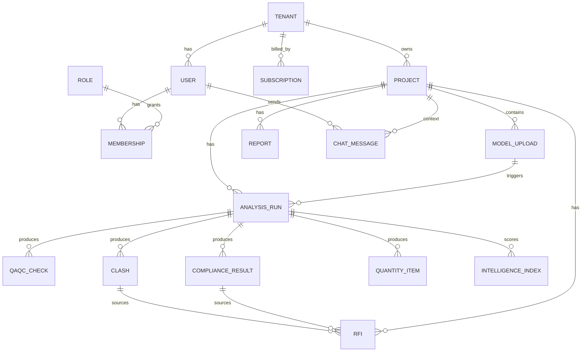

# 05 · Database Design

Target: **PostgreSQL** (multi-tenant, row-level isolation by `tenant_id`). Geometry/large files in object storage (KSA region); element graph in Postgres + optional spatial index.

## ERD (Mermaid)


## SQL (DDL)
```sql
-- ========== Tenancy & identity ==========
CREATE TABLE tenant (
  id            UUID PRIMARY KEY DEFAULT gen_random_uuid(),
  name          TEXT NOT NULL,
  cr_number     TEXT,
  country       TEXT DEFAULT 'SA',
  city          TEXT,
  data_region   TEXT DEFAULT 'ksa-central',
  created_at    TIMESTAMPTZ DEFAULT now()
);

CREATE TABLE app_user (
  id            UUID PRIMARY KEY DEFAULT gen_random_uuid(),
  email         TEXT UNIQUE NOT NULL,
  full_name     TEXT NOT NULL,
  locale        TEXT DEFAULT 'en',        -- 'en' | 'ar'
  status        TEXT DEFAULT 'invited',   -- invited | active | disabled
  created_at    TIMESTAMPTZ DEFAULT now()
);

CREATE TABLE role (
  id            SMALLSERIAL PRIMARY KEY,
  key           TEXT UNIQUE NOT NULL,     -- owner, consultant, contractor, pm, site_engineer, bim_engineer, bim_manager, admin, investor
  name_en       TEXT NOT NULL,
  name_ar       TEXT NOT NULL
);

CREATE TABLE membership (
  tenant_id     UUID REFERENCES tenant(id) ON DELETE CASCADE,
  user_id       UUID REFERENCES app_user(id) ON DELETE CASCADE,
  role_id       SMALLINT REFERENCES role(id),
  PRIMARY KEY (tenant_id, user_id)
);

CREATE TABLE subscription (
  id            UUID PRIMARY KEY DEFAULT gen_random_uuid(),
  tenant_id     UUID REFERENCES tenant(id) ON DELETE CASCADE,
  plan          TEXT NOT NULL,            -- team | enterprise | government
  status        TEXT DEFAULT 'active',    -- trialing | active | past_due | canceled
  seats         INT DEFAULT 10,
  currency      TEXT DEFAULT 'SAR',
  renews_at     TIMESTAMPTZ,
  created_at    TIMESTAMPTZ DEFAULT now()
);

-- ========== Projects & models ==========
CREATE TABLE project (
  id            UUID PRIMARY KEY DEFAULT gen_random_uuid(),
  tenant_id     UUID REFERENCES tenant(id) ON DELETE CASCADE,
  name          TEXT NOT NULL,
  client        TEXT,
  location      TEXT,
  type          TEXT,                     -- tower | infrastructure | healthcare | industrial ...
  phase         TEXT,
  value_label   TEXT,                     -- e.g. 'SAR 1.4B'
  progress      SMALLINT DEFAULT 0,       -- 0..100
  risk_level    TEXT,                     -- Critical|High|Medium|Low
  created_at    TIMESTAMPTZ DEFAULT now()
);

CREATE TABLE model_upload (
  id            UUID PRIMARY KEY DEFAULT gen_random_uuid(),
  project_id    UUID REFERENCES project(id) ON DELETE CASCADE,
  kind          TEXT NOT NULL,            -- ifc | revit | boq | specs
  file_uri      TEXT NOT NULL,            -- object storage key
  version       TEXT,
  uploaded_by   UUID REFERENCES app_user(id),
  uploaded_at   TIMESTAMPTZ DEFAULT now()
);

CREATE TABLE analysis_run (
  id            UUID PRIMARY KEY DEFAULT gen_random_uuid(),
  project_id    UUID REFERENCES project(id) ON DELETE CASCADE,
  upload_id     UUID REFERENCES model_upload(id),
  status        TEXT DEFAULT 'queued',    -- queued|reading|extracting|qaqc|clash|compliance|report|done|failed
  element_count INT,
  bim_health    SMALLINT,                 -- 0..100
  compliance    SMALLINT,                 -- 0..100
  started_at    TIMESTAMPTZ DEFAULT now(),
  finished_at   TIMESTAMPTZ
);

-- ========== Analysis outputs ==========
CREATE TABLE qaqc_check (
  id            UUID PRIMARY KEY DEFAULT gen_random_uuid(),
  run_id        UUID REFERENCES analysis_run(id) ON DELETE CASCADE,
  code          TEXT,                     -- naming | lod | coordinates | classification | metadata | duplication | sheets
  status        TEXT,                     -- Passed | Warning | Failed
  severity      TEXT,                     -- Critical|High|Medium|Low
  description   TEXT,
  recommendation TEXT,
  discipline    TEXT,
  affected      INT DEFAULT 0
);

CREATE TABLE clash (
  id            UUID PRIMARY KEY DEFAULT gen_random_uuid(),
  run_id        UUID REFERENCES analysis_run(id) ON DELETE CASCADE,
  ref           TEXT,                     -- e.g. CL-1042
  element_1     TEXT, discipline_1 TEXT,
  element_2     TEXT, discipline_2 TEXT,
  severity      TEXT,
  cost_impact   NUMERIC(14,2),            -- SAR
  delay_days    INT,
  priority      TEXT,
  location      TEXT,
  recommendation TEXT,
  state         TEXT DEFAULT 'detected'   -- detected | coordinated | resolved
);

CREATE TABLE compliance_result (
  id            UUID PRIMARY KEY DEFAULT gen_random_uuid(),
  run_id        UUID REFERENCES analysis_run(id) ON DELETE CASCADE,
  area          TEXT,                     -- sbc | civil_defense | accessibility | municipality | energy | gov
  score         SMALLINT,
  status        TEXT,                     -- Compliant | At Risk | Non-Compliant
  checks_total  INT, checks_passed INT
);

CREATE TABLE compliance_violation (
  id            UUID PRIMARY KEY DEFAULT gen_random_uuid(),
  run_id        UUID REFERENCES analysis_run(id) ON DELETE CASCADE,
  ref           TEXT,                     -- CV-01
  area          TEXT,
  severity      TEXT,
  title         TEXT,
  clause        TEXT,                     -- e.g. 'SBC 801 — 7.6.2'
  description   TEXT,
  recommendation TEXT
);

CREATE TABLE quantity_item (
  id            UUID PRIMARY KEY DEFAULT gen_random_uuid(),
  run_id        UUID REFERENCES analysis_run(id) ON DELETE CASCADE,
  item          TEXT,
  unit          TEXT,
  model_qty     NUMERIC(16,2),
  boq_qty       NUMERIC(16,2),
  variance_pct  NUMERIC(6,2),
  risk          TEXT
);

CREATE TABLE intelligence_index (
  run_id        UUID PRIMARY KEY REFERENCES analysis_run(id) ON DELETE CASCADE,
  score         SMALLINT,                 -- 0..100
  compliance    SMALLINT, quality SMALLINT, risk SMALLINT, cost SMALLINT, schedule SMALLINT
);

-- ========== RFIs, reports, chat ==========
CREATE TABLE rfi (
  id            UUID PRIMARY KEY DEFAULT gen_random_uuid(),
  project_id    UUID REFERENCES project(id) ON DELETE CASCADE,
  ref           TEXT,                     -- RFI-031
  subject       TEXT,
  question      TEXT,
  discipline    TEXT,
  priority      TEXT,
  status        TEXT DEFAULT 'Draft',     -- Draft | Issued | Answered
  attachment    TEXT,
  source_ref    TEXT,                     -- clash/violation/quantity ref
  raised_by     UUID REFERENCES app_user(id),
  created_at    TIMESTAMPTZ DEFAULT now()
);

CREATE TABLE report (
  id            UUID PRIMARY KEY DEFAULT gen_random_uuid(),
  project_id    UUID REFERENCES project(id) ON DELETE CASCADE,
  run_id        UUID REFERENCES analysis_run(id),
  kind          TEXT DEFAULT 'executive',
  pdf_uri       TEXT,
  created_at    TIMESTAMPTZ DEFAULT now()
);

CREATE TABLE chat_message (
  id            UUID PRIMARY KEY DEFAULT gen_random_uuid(),
  tenant_id     UUID REFERENCES tenant(id) ON DELETE CASCADE,
  project_id    UUID REFERENCES project(id),
  user_id       UUID REFERENCES app_user(id),
  role          TEXT,                     -- user | ai
  content       TEXT,
  created_at    TIMESTAMPTZ DEFAULT now()
);

-- ========== Indexes ==========
CREATE INDEX idx_project_tenant      ON project(tenant_id);
CREATE INDEX idx_upload_project      ON model_upload(project_id);
CREATE INDEX idx_run_project         ON analysis_run(project_id);
CREATE INDEX idx_clash_run           ON clash(run_id);
CREATE INDEX idx_qaqc_run            ON qaqc_check(run_id);
CREATE INDEX idx_compliance_run      ON compliance_result(run_id);
CREATE INDEX idx_violation_run       ON compliance_violation(run_id);
CREATE INDEX idx_quantity_run        ON quantity_item(run_id);
CREATE INDEX idx_rfi_project         ON rfi(project_id);
CREATE INDEX idx_chat_project        ON chat_message(project_id);
CREATE INDEX idx_membership_user     ON membership(user_id);

-- Row-level security (multi-tenant isolation)
ALTER TABLE project ENABLE ROW LEVEL SECURITY;
CREATE POLICY tenant_isolation ON project
  USING (tenant_id = current_setting('app.tenant_id')::uuid);
-- (repeat analogous RLS policies on all tenant-scoped tables)
```

## Notes
- All tenant-scoped tables carry/derive `tenant_id` and enforce **RLS** for company isolation.
- Enum-like columns use text + check constraints (or Postgres enums) to keep them readable.
- Bilingual content (e.g., role names) stored as `*_en` / `*_ar`; user-facing engineering content can be translated at the service layer or stored bilingually.
