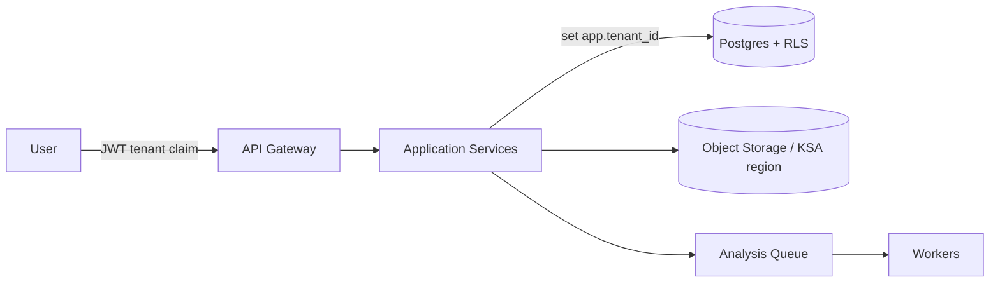

# 11 · SaaS Architecture

## Multi-tenant design
- **Model:** single database, **shared schema**, row-level isolation by `tenant_id` (Postgres **RLS**). Large objects (models, reports) in per-tenant object-storage prefixes.
- **Tenant context:** resolved from JWT `tenant` claim → set `app.tenant_id` GUC per request → RLS policies enforce isolation on every table.
- **Noisy-neighbor:** per-tenant rate limits & analysis-queue quotas; heavy 3D/analysis jobs run in isolated workers.
- **Scaling path:** start shared-schema; offer **dedicated schema/DB or sovereign/on-prem** for Government tier.

## Company isolation
- RLS on all tenant-scoped tables; storage keys namespaced `tenant/{id}/...`.
- Per-tenant encryption keys (envelope encryption); audit log partitioned by tenant.
- No cross-tenant joins; admin/superuser access is break-glass + audited.

## Subscription plans
| Plan | Price (SAR) | Projects | Users | Highlights |
|---|---|---|---|---|
| **Team** | 4,900 / mo | up to 5 | 10 | QA/QC + Clash Intelligence, standard support |
| **Enterprise** | 18,500 / mo | unlimited | unlimited | Full Saudi Compliance Engine, AI Chat + Smart Reports, **KSA data residency**, priority support |
| **Government** | Custom | unlimited | unlimited | On-prem / sovereign cloud, Etimad & Balady integration, dedicated success engineer, security accreditation |

Add-ons (metered): extra analysis runs, AI tokens, storage, premium connectors.

## Billing logic
- **Provider:** subscription billing (e.g., Stripe / local PSP for SAR & VAT/ZATCA e-invoicing).
- **Model:** seat-based base + usage add-ons. Proration on plan change; 14-day trial.
- **States:** `trialing → active → past_due → canceled` (mirrored on `subscription`).
- **Enforcement:** entitlement service maps plan → feature flags (compliance engine, AI chat, residency, integrations, seat limits). Gateway checks entitlements before privileged endpoints.
- **Invoicing:** monthly invoice + ZATCA-compliant e-invoice (Arabic/English); dunning on `past_due`.

## Feature flags / entitlements
`compliance_engine`, `ai_chat`, `copilot`, `ksa_residency`, `connectors_acc`, `connectors_navisworks`, `api_access`, `seats_limit`, `projects_limit`, `sovereign_hosting`.

## Reliability & security
- Background job queue for long analysis (idempotent, retriable); WebSocket/SSE progress.
- Backups: encrypted daily, 30-day recovery; PITR.
- Security: AES-256 at rest, TLS 1.3 in transit, RBAC, full audit trail, ISO 27001 path.
