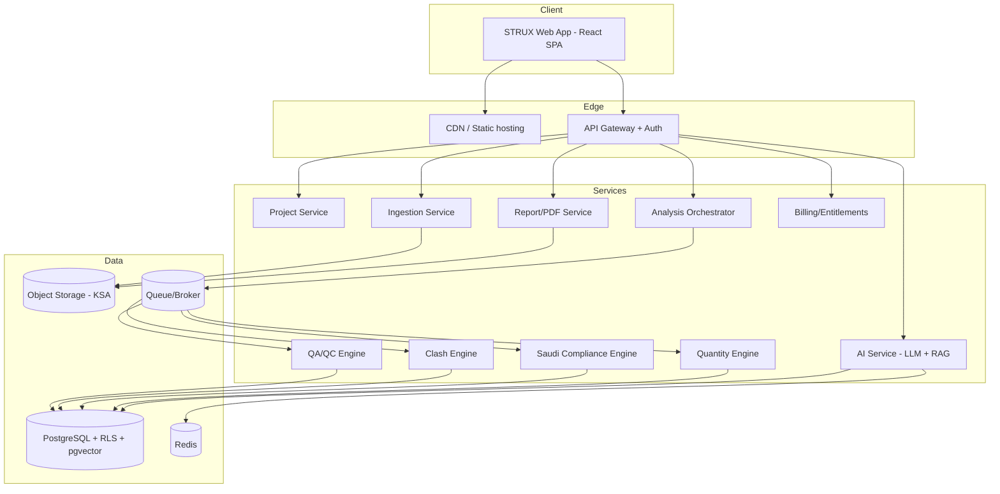
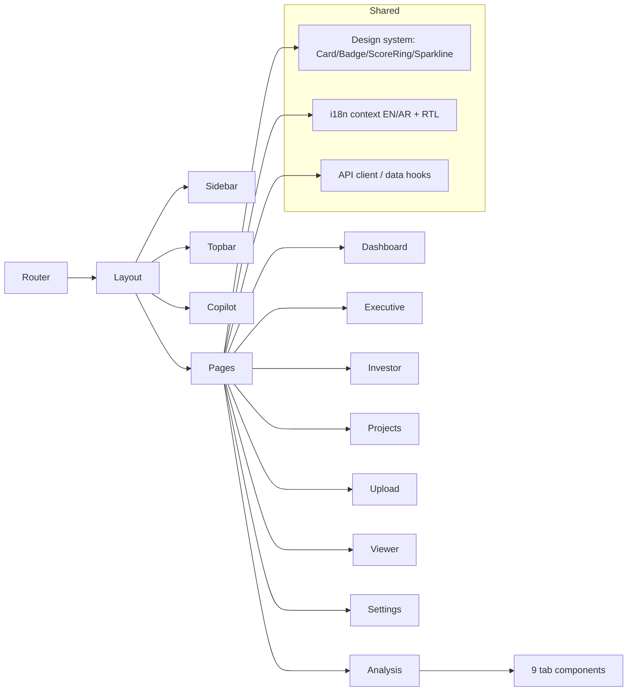
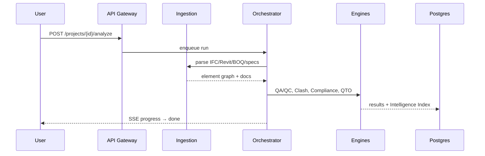
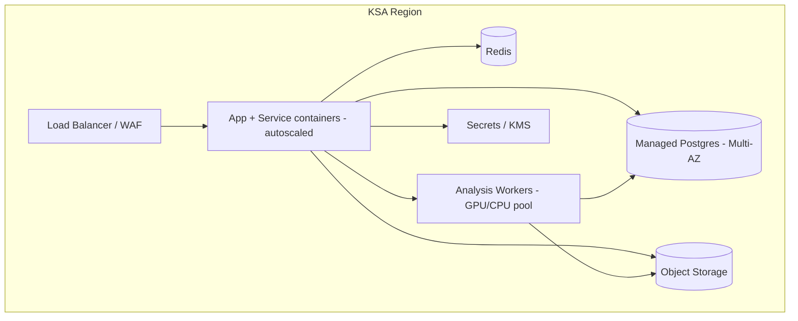

# 13 · Technical Architecture

## Current (prototype)
- **Frontend:** React 18 + TypeScript + Vite + Tailwind + React Router + Recharts + Three.js (`@react-three/fiber`, `drei`).
- **State/data:** local component state + mock data (`src/data/*`); i18n via React context (EN/AR, RTL).
- **No backend** yet; deploy as static SPA (Vercel).

## Target (production)

### System context


### Frontend architecture

- **Patterns:** component-based, route-level code-splitting, lazy-load heavy 3D (`BIMScene`), context for i18n & (future) auth/tenant.

### Backend architecture
- **Style:** API gateway + modular services (modular monolith acceptable for MVP; split engines into workers).
- **Sync API:** projects, RFIs, reports, dashboards, chat (REST/JSON).
- **Async pipeline:** upload → queue → orchestrator drives QA/QC → Clash → Compliance → QTO → Index → report; progress via SSE/WebSocket.
- **Ingestion:** IFC via `IfcOpenShell`/`web-ifc`; Revit via **Autodesk Platform Services (APS) Model Derivative**; BOQ via spreadsheet parser; specs via PDF/NLP.



### Database architecture
- PostgreSQL (primary) with **RLS** tenant isolation + **pgvector** for RAG. Read replicas for analytics. Object storage for models/reports. Redis for cache/queues/rate-limits. See [05-database-design](./05-database-design.md).

### Cloud architecture (KSA residency)

- **Hosting:** KSA region (e.g., regional cloud / sovereign cloud for Government). Containers (K8s/managed). IaC (Terraform). CI/CD with preview deploys.
- **Security:** TLS 1.3, AES-256, KMS-managed keys, WAF, audit logging, PDPL/SDAIA alignment, ISO 27001 roadmap.
- **Observability:** centralized logs, metrics, traces; per-tenant usage metering.

## Repository layout (current FE)
```
src/
  main.tsx App.tsx index.css
  i18n/ (dictionary.ts, index.tsx)
  data/ (mock.ts, ar.ts)
  components/ (Layout, Brand, Logo, Loader, Copilot, IntelligenceIndex,
              Vision2030, BIMSnapshot, ProjectThumb, three/BIMScene, ui/*)
  pages/ (Landing, Login, Dashboard, Executive, Investor, Projects, Upload,
          Analysis, Viewer, Settings, analysis/<9 tabs>)
```
